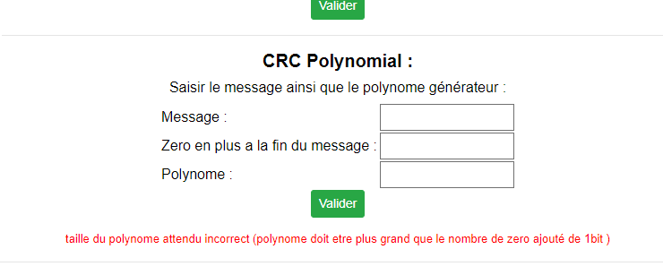
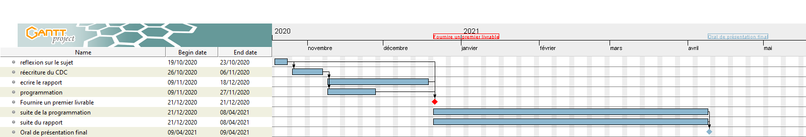

\centering


\Large Année : 2020/2021\hspace{50pt} IUT de Vélizy \hspace{50pt} Tuteur: M.Hoguin
\vfill
\large \hspace{10pt} PIERRE Tom - GIANNICO Raffaele - PARISOT Theo - MANOHARAN Anushan
\raggedright
\clearpage

```{r setup, include=FALSE}
knitr::opts_chunk$set(echo = TRUE)
```

`r if(knitr:::pandoc_to() == "latex") {paste("\\newpage")}`

## Remerciements
\centering
\vspace{75mm}
En premier lieu, nous tenons à remercier M. Hoguin, enseignant à l'Iut de Vélizy. En tant qu'enseignant, il nous a beaucoup appris et a partagé ses connaissances dans le domaine du réseau.

\vspace{5mm}

Nous souhaitons adresser nos remerciements aux enseignants du module Méthodologie de Production et d'Application de l'Iut de Vélizy, pour la qualité de l’enseignement.

\vspace{5mm}

Nous désirons aussi remercier tout les enseignants de l'Iut de Vélizy, car sans eux nous n'aurions pas pu faire ce travail.

\vspace{5mm}

Un grand merci à nos familles, pour leurs conseils ainsi que leurs soutiens moral.

\raggedright

`r if(knitr:::pandoc_to() == "latex") {paste("\\newpage")}`

## Résumé

### Résumé

Notre projet etait de developer une application web à destination des étudiants de première années en informatique, visant a les aider dans le module réseaux.Pour ça nous devions prendre les cours de Monsieur Hoguin, et faire des applications mettant en pratique ces cours, permettant aux étudiants de mieux comprendre et de pouvoir verifier aussi leurs résultats.
Cette application web sera heberger sur un serveur de l'iut ce qui permettera aux étudiants d'y acceder facilement en tapant dans leur navigateur 192.168.2.3.ou http://projetrsx
`r if(knitr:::pandoc_to() == "latex") {paste("\\newpage")}`

### Sommaire

\tableofcontents
`r if(knitr:::pandoc_to() == "latex") {paste("\\newpage")}`

## Introduction

La réalisation d'un projet tuteuré a de multiples objectifs: apprendre à travailler en groupe, se familiariser
avec des outils et des langages, apprendre à définir, analyser, réaliser et tester un système informatique
complexe. C'est pourquoi, le département Informatique de l'IUT nous a confié ce projet. 

Le projet final que nous devrons présenter sera une application pédagogique pour apprendre aux étudiants de première année de l'iut de Vélizy, les fondamentaux du réseau au travers d’une interface web. Cette interface web sera constituée de plusieurs pages internet contenant chacun une fonctionnalité de l'application (les fonctionnalités sont décrite dans le cahier des charges qui sera transmis en Annexe 1). Ainsi nous apporterons une explication pour faire comprendre de manière simple le réseau aux étudiants. Il faudra alors réfléchir à notre interface web que nous allons mettre en place. C'est pourquoi nous devons non seulement se mettre à la place d’un développeur, mais aussi à la place de l'utilisateur, et devons trouver comment attirer les étudiants, comment leur donner envie d'apprendre le réseau.

`r if(knitr:::pandoc_to() == "latex") {paste("\\newpage")}`
## Partie 1 : Solution proposée - Demarche utilisée
### Qualité Logicielle
#### La capacité fonctionnelle  :

Les applications proposent d'afficher des résultats de diverses notions de réseaux en quelques instants qui sont appris au semestre 2 du DUT informatique. Ils ont pour but d'aider les étudiants à vérifier leurs résultats et à mieux comprendre le cours. Toutes les fonctionnalités demandés ont été implémenter à savoir :

- Traduire une adresse IP de binaire à décimal et inversement,
- Traduire une adresse IP d'héxadécimal à décimal et inversement,
- Diviser un réseau en sous-réseau avec la notation CIDR,
- Diviser un réseau en sous-réseau avec la notation VLSM,
- Calculer un CRC matriciel et polynomial,
- Exécuter des commandes réseau,
- avoir un glossaire constitué des mots clé utilisée dans les fonctionnalitées,
- un Manuel d'utilisation.

#### La fiabilité :

Les applications proposés ont des fins pédagogiques, les étudiants auront confiance en ces applications. C'est pourquoi, ils ne doivent en aucun cas produire de faux résultats. Pour palier à cela nous avons fait, pour chaque applications une phase de recherche des erreurs. Nous en avons conclus que les applications étaient fiables. Nous avons donc comparés nos résultats (trouvé sur papier) avec les résultats proposés par l'application, on trouve bien les même résultat. Notre tuteur, M. Hoguin a contribué à la vérification des résultats. Et enfin, grâce à des outils en ligne, qui proposait des services similaires, nous avons pu comparé nos résulats. Et, les applications ont passer ces tests avec succès.


#### la facilité d'utilisation :

Pour nous c'etait impensable que cette application ne soit pas facile à utiliser. Premierement, car elle sera utilisée principalement par des étudiants. Aussi, parce qu'elle servira de support de cours pour ces étudiants. Il a fallut travailler d'arache pied pour rendre cette plateforme simple d'utilisation. Et, il doit être beau à voir pour qu'ils aient envie de l'utiliser. On a commencer par la page d'accueil en mettant des grandes images avec le nom de chaque fonctionnalité, comme vous pouvez voir Annexe 2. De plus, via le menu en haut de chaque page, il est très facile de voyager entre chaque fonctionnalité. Celles-ci sont composées de cours expliquant la méthode à utiliser si l'on veut le faire soi-même, et une application pour mettre en pratique ce cours. Pour rendre ces applications plus simple, une indication est présente à chaque fois qu'une information est attendu. Et, en cas de problème des messages d'erreurs apparaîtront et vous expliqueront ce qu'il ne va pas cf Annexe 3.  

#### La performance :

Aussi étant héberger en ligne, il n'est pas nécessaire d'avoir une machine surpuissante pour utiliser cette platforme. Et les résultats apparaissent rapidement, car ce ne sont pas des algorithmes très complexes. Et donc, cette platforme est accessible, depuis toutes les machines de l'iut, et même depuis chez-soi en utilisant le logiciel Putty.


#### la maintenabilité :

Il est possible à l'avenir de rajouter des applications sans tout changer, il est seulement nécessaire de rajouter une page dans laquelle on y ajoute la nouvelle fonctionnalité. Et d'y ajouter l'accès sur la page d'accueil. Ce site est donc extensible. En outre, si un probleme est détecté, il peut être corriger en ciblant seulement la partie problématique sans avoir à tout changer. 

### Organisation de l'équipe
#### Organigramme :


Pour ce projet nous étions 4, il y avais PARISOT Theo, MANOHARAN Anushan, GIANNICO Raffaele et PIERRE Tom. Aujourd'hui Nous ne somme plus que deux, il reste GIANNICO Raffaele et PIERRE Tom. et nous avons repatie les taches entre nous, Raffaele s'est occupée de l'index, de tout ce qui s'approche de l'aspect graphique de l'application, des fonctionnalités de découpage de sous réseaux, ainsi que le stockage csv du glossaire. tandis que Tom s'est occupé du reste des fonctionnalités (traduction d'adresses IP, CRC, commande Réseau...) et de leurs interfaces associée tout en aidant raffaele dans ces fonctionnailitées.

#### Raison :


Nous avons répartie les tâches comme ceci car Raffaele avait une meilleur connaissance sur les fichiers Csv et sur les styles en web. Tandis que Tom avait plus de connaissances pour établir un algorythme (qu'est ce qu'il nous faut pour tel fonctionnalité, comment traiter les données etc..) et coder l'interface qui lui permet de fonctionner.

#### Avantages :


En répartissant ainsi le travail, cela nous permet d'avancer plus vite car la personne qui est plus à l'aise sur une fonctionnalité sera la plus qualifiée pour le faire et mettra donc moins de temps.


### Méthode utilisé
#### Explications :

La méthode SCRUM est une méthode agile, où le logiciel est développé ou évolue sous formes de sprints qui sont des phases de développement qui sont concentré sur des fonctionnalités. L'équipe est donc autoorganisée et peut choisir la meilleure façon d’accomplir sa tâche. De plus, cette méthode inclut la participation et l’implication active du client durant l’intégralité du projet.


#### Raison :

Avec l'université, nous ne pouvions travailler à temps plein. C'est pourquoi, lorsque nous finissions plus tôt, ou le week end, nous nous concentrions chacun sur une des fonctionnalités. C'est la méthode qui nous semblait le plus logique, et la plus adapté à notre situation. Aussi, nous voulions que le client soit le plus actif possible dans ce projet pour être sûr que la fonctionnalité programmé correspond bien aux attentes du client au niveau de l'esthétique ou bien du fonctionnement en lui-même.

#### Avantages :

Cette méthode a pour principal avantage de produire rapidement un livrable grâce aux sprints. En produisant des livrables rapidement est régulièrement, cela permet notamment d'intégrer le client au projet. Ainsi, il est au courant de tout ce qui se passe, et il est possible d'agir très vite et d’intégrer les modifications plus rapidement. De même, un projet peut etre amené à évoluer. Donc cela favorise la réactivité et l'adaptabilité.

Scrum favorise donc la productivité, les tâches sont découpées en sous-tâches, et chacun à sa tâche à faire.


### Nos outils de suivi
#### La gestion de version - GIT :

Nous avons utilisé GitLab pour mieux collaborer entre nous mais aussi avec le client afin de voir les évolutions. Voici le lien du gitLab, https://gitlab.com/pleijan/projet-tutoree-aide-reseau-premiere-annee, sur ce gitlab il y a :
- le code source (toute les pages web)
- les photos utilisée sur l'application
- le rapport ainsi que les presentation orale du projet.

#### un agenda hybride :
Pour produire ce projet nous nous sommes répartie les taches sur le temps mais globalement sur une semaine type, le soir en semaine nous travaillons sur nos fonctionnalitée et le week-end nous verifions si tout ce qui a été codé est bien fonctionnel.

#### Communication générale :

Notre manière de communiquer était sur un groupe privé du logiciel Discord. Et de manière récurrente, nous nous échangions nos évolutions, ou alors nos idées.
Aussi nous avons utilisé la plateforme Zoom pour communiquer avec notre client, faire une réunion avec lui pour faire un point sur la situation, lui poser des questions, savoir ce qu’il pense de notre avancé du projet.

### Planification détaillée du projet
#### Ordonnancement :

Pour ce projet nous avons essayer d'appliquer une une méthode de travail simple, nous voulions au debut commencer par le recueil des besoins ainsi que la conception, commencer à coder et écrire en même temps le rapport. Au final nous avons changer de méthode de travail, nous avons pratiquer une sorte de méthode scrum, car nous essayons de faire une fonctionnalitée en 

#### Diagramme de gantt :

Nous avons fait un diagramme de Gantt pour pouvoir situer les différentes tâches du projet dans le temps, comme on peut le voir sur le diagramme mis en Annexe 4. Nos travaux étaient répartis sur plusieurs semaines. Nous avons d’abord réfléchi sur le projet avec tout le monde pendant une semaine. Ensuite nous avons réécrit le cahier des charges qui nous a pris environ deux semaines. Puis, nous avons fait en parallèle le développement et le rapport jusqu’au 18 décembre, date où le premier rapport devait être rendu. Enfin, nous avons continuer a developpé et écrire ce rapport jusqu'à la date finale de rendu le 07/04/2021.

#### La gestion des compétences :

Raffaele avais plus de connaissance et d'experience sur le cotée graphique d'un site internet et sur les divisions de réseaux tandis que Tom avait plus de faciliter pour construire des algorythmes notamment pour le CRC ou les traduction d'adresse IP.

#### La gestion des risques :


Tout d'abord voici la liste des risques qui pourrais arriver pendant notre projet :

- Absences pour de certains membres pour des raisons quelconques 
- Abandon de certains membres de l’équipe.  
- Travail en simultanée pour l’université  
- Manque de connaissances 
- Matériels défectueux  
- Mauvaise communication 
- Mauvaise répartition des tâches 
- Erreur de commit (pertes des données) 
- Sous-estimer de la complexité d’une tâche. (Compétences) 
- Insatisfaction du client 
- Pertes de motivation de l’équipe 
- Mauvaise exécution des tests 
- Mauvaise cohésion d’équipe. 
- Évolution du projet 
- Mauvaise méthode de travail 
- Client injoignable  
- Mauvaise entente avec le client 
- Client incertain 
- Conflit au sein de l’équipe 

Pour determiner la probabilitée des risques et leur impact on va créer des echelles définie ci-dessous :

On va créer une échelle pour la probabilité de réalisation d’un risque qui va de 1 à 5, défini dans le tableau disponible en annexe 5

On va créer une deuxième échelle pour l’impact sur le projet allant de 1 à 3, défini dans le tableau disponible en annexe 6

Et donc grace au differentes echelle on peux determiner un tableau avec les risque et leur probabilitée d'existences et leur impact qui est affichée dans l'annexe 7.

#### Les cas d'utilisations :

Les acteurs de ce projet sont les étudiants de première année du département Informatique de l'iut de Vélizy.
Les objets sont :  menu, Adresses IP, masque, traduction, binaire, héxadécimal, décimal, valider, CIDR, VLSM, Calcul CRC, sniffer nmap, trouver, champs de textes.

Les actions sont donc :


- choisir une fonctionnalité dans le menu ou depuis l'index     					 
- Traduction des adresses IP Decimal <-> héxadécimal          	 
- Traduction des adresses IP Decimal <-> binaire              	 
- Diviser les réseaux en Sous-réseaux avec les notations CIDR/VLSM 
- Calculer des CRC matriciel/polynomial                                 	 
- Exécutions de commandes réseaux                                					 
- Consulter des pages de cours associés aux fonctionnalités 
- accéder au glossaire
- Consulter la page Traduction Decimal <-> héxadécimal			    
- Consulter la page Traduction Decimal <-> binaire				    
- Consulter la page Sous-réseaux avec la notation CIDR		    
- Consulter la page Sous-réseaux avec la notation VLSM		    
- Consulter la page Calcul CRC										
- Consulter la page commande nmap										
- Consulter la page commande ping 
- Consulter la page commande man 
- Consulter la page commande tcpdump 
- Consulter la page commande nslookup 
- Consulter la page du glossaire 
- Consulter une page de cours associé à une fonctionnalité 
- Traduction d'une adresse IP Decimal <-> héxadécimal					
- Traduction d'une adresse IP Decimal <-> binaire						
- Diviser un réseau en Sous-réseaux avec la notation CIDR		
- Diviser un réseau en Sous-réseaux avec la notation VLSM		
- Fonction qui calcul un CRC matriciel											
- Fonction qui calcul un CRC polynomial											
- exécuter commande nmap					
- exécuter commande ping					
- exécuter commande man					
- exécuter commande tcpdump					
- exécuter commande nslookup
- modifier/supprimer un mot dans le glossaire					
- se connecter en admin au glossaire					
- écrire dans le champ de texte l'adresse IP hex-dec               
- écrire dans le champ de texte l'adresse IP bin-dec               
- écrire dans les champ de texte pour les Sous-réseaux  
- écrire dans les champs pour le CRC								    
- écrire dans les champs de textes pour exécuter une commande réseau 
- valider hex-dec                                                     
- valider bin-dec                                                     
- valider pour les Sous-réseaux                                       
- valider pour le CRC												    
- valider commande réseau		    
- Affiche l'adresse IP traduite hex-dec							    
- Affiche l'adresse IP traduite bin-dec							    
- Affiche les sous-réseaux										    
- Affiche le CRC 													    
- Affiche le résultat de la commande réseau entrée					    
- Erreur apparaît si adresse IP hex-dec invalide                      
- Erreur apparaît si adresse IP bin-dec invalide                      
- Erreur apparait si un champ est mal rempli pour les Sous-réseaux     
- Erreur apparaît si champ du CRC invalide						    
- Erreur apparaît si la commande entrée est invalide	    		
- écrire dans les champs pour ajouter un mot et sa définition au glossaire	    
- écrire dans les champs pour se connecter en admin au glossaire	    
- valider la connexion admin au glossaire                                                     
- valider la saisie d'un mot pour le glossaire                                                     
- erreur apparait si mauvais login ou mdp                                                     

Les étudiants pourront utiliser ces fonctionnalités. Vous pourrez trouver le schéma des cas d'utilisations en Annexe 8.

`r if(knitr:::pandoc_to() == "latex") {paste("\\newpage")}`
## Partie 2 : analyse de la réalisation

### Exigences Critiques

Le but premier est d'être le plus pédagogique possible. De plus, il faut, avoir une page d'accueil avec un menu qui permet de naviguer entre les différentes fonctionnalités. En effet, sans un menu ou un lien pour naviguer entre les différentes fonctionnalités, il n'est pas possible d'utiliser le site correctement. Bien sûr, sans un minimum de fonctionnalité, l'étudiant ne peut rien apprendre. De plus, les résultats produits par les différentes fonctionnalités doivent être sûr de donner les bons résultats, pour ne pas porter de confusion aux étudiants. Aussi, les fonctionnalités comme le CRC polynomial et le CIDR sont des fonctionnalités légèrement complexes ce qui coûte un peu plus au niveau du temps.

### Exigences majeures

Toutes les fonctionnalités sont indépendantes les une les autres. C'est pourquoi, si une fonctionnalité ne fonctionne pas correctement, on peut s'en passer au début, cela n'empêche pas le systeme de fonctionner pour le moment. Aussi, les cours de chacunes des pages de même n'empêche pas les cours de fonctionner mais ils doivent être implémenter dés que possible Et qu'ils soient associés chacun à un cours. Les fonctionnalités qui peuvent être considérer comme majeure sont principalement les traductions d'adresses IP, et les divisions de sous-réseaux, les deux types de CRC et l'exécution des commandes réseaux.

### Exigences Mineures

L'exigence mineure serait l'esthétique du site. En effet, le but est d'apprendre quelque chose aux étudiants, et l'esthétique ne va pas empêcher cela. Par conséquent ce n'est pas urgent. Néanmoins, il serait souhaitable d'implémenter cette exigence car une personne à plus envie d'aller sur un site esthétique qu'un site basique. Cela peut aussi donner plus d'envie d'apprendre.

### Exigences supplémentaires

Au fur et à mesure de l'avancement du projet, le client à eu quelques idées supplémentaires comme par exemple, ajouter une fonctionnalité qui retourne l'adresse réseau d'une adresse IP, ou bien, l'ajout d'un glossaire avec la possibilité pour l'admin de rajouter des mots et même de les modifier. Aussi, une fonction capable d'afficher les données de l'utilisateur. Ces exigences ne sont pas nécessaire, et sont à implémenter seulement si l'on a du temps.

`r if(knitr:::pandoc_to() == "latex") {paste("\\newpage")}`
## Partie 3 : Conclusions et bilan du projet
### Bilan de réalisation
A l'heure d'aujourd'hui, le projet est quasiment fini, toutes les fonctionnalités demander dans le cahier des charges ont été développer, confirmer et disponible pour n'importe quel étudiant. Cependant, nous savions que ce projet était évolutif car dans ce type de projet n'importe quel idée peux devenir une réelle demande du client, si nous devions faire le point sur tout ce qui était demander nous avions :

- la traduction d'adresse IP entre hexadecimal et decimal ou entre binaire et decimal.
- l'adressage de sous réseaux en notation CIDR et VLSM.
- le calcul matriciel et polynomial d'un CRC.
- 5 commande réseaux sous linux (ping, nmap, nslookup, man et tcpdump).
- un glossaire qui repertorie l'ensemble des mots important.
- et un manuel d'utilisation.

Et donc parmis toutes ces tâches à accomplir seulement la commande reseau tcpdump na pas été accomplie.

### Des evolutions possibles ?

Ce projet est-il évolutif ? La réponse est oui, tout d'abord car les cours qui y sont présent sont ceux de premiere années on pourras rajouter les cours du semestre 3 et ensuite la spécialisation réseaux du semestre 4. On peux aussi l'étendre à n'importe quel module, ce qui offre une possibilitée d'extensions tout à fait énorme.

### Des acquis divers et variés
#### Savoir-être

Ce projet nous a permis d'apprendre à travailler en équipe, de faire face à des réduction d'effectifs, des crises sanitaires, tout en respectant les délais pour produire notre projet. Et, grâce à cet experience c'est évident que nos capacités en sont sortie grandie.

#### Savoir-Faire

Nous avons aussi acquis de l'expérience niveau technique, car en effet comme vu précedemment, de nombreux obstacles on fait surface qui nous ont forcer à nous documenter, à essayer maintes et maintes fois. Ainsi, pour résoudre ces problemes, nous nous sommes donc servis à la fois de tout nos cours de programmation web, de mathematiques, mais aussi de certains site comme la documentations de php (php.net) ou encore W3School qui repertorie de nombreux sujet pour aider tout les developpeurs. 

### Une Experience fondamentale
`r if(knitr:::pandoc_to() == "latex") {paste("\\newpage")}`
## Partie 4 : Bibliographie

`r if(knitr:::pandoc_to() == "latex") {paste("\\newpage")}`
## Partie 5 : Annexes

## Annexe 1 : Cahier des charges point de vu dévelopeur 
| Développement d'une Application Web,  qui va aider les premieres années à l'iut de velizy | Version : 3        |   |   |   |
|-------------------------------------------------------------------------------------------|--------------------|---|---|---|
| Document : Cahier des charges                                                             | Date: <27/11/2020> |   |   |   |
| Responsable de la Redaction: Raffaele                                                     |                    |   |   |   |
|                                                                                           |                    |   |   |   |

### Introduction
Ce projet tutoré qui nous a été confié par M.Hoguin enseignant à l'iut de Vélizy est de créer une application web pédagogique afin d'aider les premières années dans le module réseau du département informatique.

### Enoncé
L’application web devra permettre aux étudiants débutants d’aborder les notions de réseau vues au semestre 1 sous un angle pédagogique et ludique au travers de possibles animations. L'application WEB classique sera hébergée en intranet et devra contenir divers fonctionnalités accessible depuis un menu. Le menu devra contenir le logo de l'UVSQ et devra contenir toute les fonctionnalités présent sur le site comme :

- Traduire une adresse IP de binaire à décimal et inversement,
- Traduire une adresse IP d'héxadécimal à décimal et inversement,
- Diviser un réseau en sous-réseau avec la notation CIDR,
- Diviser un réseau en sous-réseau avec la notation VLSM,
- Calculer un CRC matriciel et polynomial,
- Exécuter des commandes réseaux.
- avoir un glossaire qui pour les etudiant recenserons les mots clé du module réseau et pour l'administrateur pourra gérer ces mots clée pour en ajouter ou supprimer.
- avoir un manuel utilisateur qui explique comment utiliser chaque recoins du site.

Sur la page d'accueil, il pourra y avoir quelques informations sur l'utilisateur du site comme l'adresse IP et le navigateur qu'il utilise. Sur chaque pages il y aura une partie cours et une partie dédié à l'application. L'utilisateur entre l'adresse IP dans des champs de texte, et le programme traduit ces Adresses IP décimal en hexadécimal ou binaire et inversement. Si l'utilisateur entre un nombre supérieur à 255 en décimal une erreur apparaîtra. De même pour la partie traduction en binaire, si pour un champ, l'utilisateur entre plus de 8 bits ou un chiffre non binaire, une erreur apparaîtra. Et enfin, pour la partie traduction en hexadécimal si l'utilisateur entre un caractère non hexadécimal ou plus de 2 caractères par champs une erreur apparaîtra.  

L'utilisateur entre l'adresse IP dans des champs de texte, entre le masque avec la notation CIDR, et le nombre de sous-réseaux souhaité, le programme se chargera de diviser ce réseau en sous-réseaux avec la notation CIDR. Pour la fonctionnalité VLSM, cela fonctionne de même concernant l'adresse IP et le masque. Seulement, l'utilisateur ajoute des sous-réseaux grâce à un bouton "plus". Des champs apparaissent pour noté le nombre d'hôtes souhaité. De même, si l'adresse IP ou le masque n'est pas correctement entrée une erreur apparaîtra. Nous avons choisi de laisser le choix à l'utilisateur quant à la saisie du masque réseau. En effet, il peut écrire le masque avec la notation CIDR (/24) ou bien de façon "normal" (255.255.255.0). Sur ces deux pages énoncé précédemment, le client souhaite un ajout supplémentaire, c'est-à-dire une fonctionnalité capable de retourner l'adresse réseau d'une adresse machine. Et le principe fonctionne de la même maniere que les autres champs d'adresses IP.

La fonctionnalité CRC propose deux versions. Le CRC matriciel, ainsi que polynomial. Des champs sont présents pour y inscrire le message souhaité ainsi que la matrice, pour le CRC matriciel. Ou bien le nombre de zéros a ajouté ainsi que le polynôme pour le CRC polynomial.

Il y aura aussi une rubrique commande réseaux ou grâce à des champs, on pourra inscrire une commande réseau comme nmap, ping, man, tcpdump, nslookup. Et le résultat apparait à l'écran.


### Prérequis
Avoir envie de travailler sur une application web et sur les connexions avec les outils réseaux

### Priorités
Les fonctionnalités passent avant l'esthétique.

`r if(knitr:::pandoc_to() == "latex") {paste("\\newpage")}`
## Annexe 2 : capture d'écran de l'accueil du site 

| La page d'accueil du site | Version : 1        |   |   |   |
|-------------------------------------------------------------------------------------------|--------------------|---|---|---|
| Document : Capture d'écran                                                            | Date: <28/03/2021> |   |   |   |
| Responsable de la Redaction: Tom                                                     |                    |   |   |   |
|                                                                                           |                    |   |   |   |


## Annexe 3 : capture d'écran de message d'erreur aidant les étudiants

| Exemple d'une erreur qui guidera les étudiants | Version : 1        |   |   |   |
|-------------------------------------------------------------------------------------------|--------------------|---|---|---|
| Document : Capture d'écran                                                              | Date: <28/03/2021> |   |   |   |
| Responsable de la Redaction: Tom                                                     |                    |   |   |   |
|                                                                                           |                    |   |   |   |


## Annexe 4: diagramme de gantt represantant l'avancement du projet


| diagramme de gantt represantant l'avancement du projet | Version : 3        |   |   |   |
|-------------------------------------------------------------------------------------------|--------------------|---|---|---|
| Document : Capture d'écran                                                              | Date: <28/03/2021> |   |   |   |
| Responsable de la Redaction: Tom                                                     |                    |   |   |   |
|                                                                                           |                    |   |   |   |


## Annexe 5 : tableau de l'echelle de probabilitée du risque 
| tableau de l'echelle de probabilitée du risque | Version : 1        |   |   |   |
|-------------------------------------------------------------------------------------------|--------------------|---|---|---|
| Document : tableau de l'echelle de probabilitée du risque                                                          | Date: <20/11/2020> |   |   |   |
| Responsable de la Redaction: tom                                                      |                    |   |   |   |
|                                                                                           |                    |   |   |   |


|Degré |1            |2                   |3                    |4                  |5                                |
|------|-------------|--------------------|---------------------|-------------------|---------------------------------|
|def   |Improbable   |Faiblement probable |Moyennement probable |Fortement probable |Déjà arrivé ou certain d’arriver |

Tableau de l'echelle de probabilitée du risque.
1 Improbable, 5 Déjà arrivé ou certain d’arriver

`r if(knitr:::pandoc_to() == "latex") {paste("\\newpage")}`
## Annexe 6 : tableau de l'echelle de l'impact d'un risque sur le projet
| tableau de l'echelle de l'impact d'un risque sur le projet | Version : 1        |   |   |   |
|-------------------------------------------------------------------------------------------|--------------------|---|---|---|
| Document : tableau de l'echelle de l'impact d'un risque sur le projet                     | Date: <18/12/2020> |   |   |   |
| Responsable de la Redaction: Tom                                                      |                    |   |   |   |
|                                                                                           |                    |   |   |   |

|Degré |1              |2            |3              |
|------|---------------|-------------|---------------|
|def   |Impact faible  |Impact moyen |Impact grand   |

Tableau de l'echelle de l'impact d'un risque sur le projet.
1 Impact faible, 3 Impact retard

`r if(knitr:::pandoc_to() == "latex") {paste("\\newpage")}`
## Annexe 7: tableau des differents risque avec leur impact
| tableau des differents risque avec leur impact | Version : 1        |   |   |   |
|-------------------------------------------------------------------------------------------|--------------------|---|---|---|
| Document : tableau des differents risque avec leur impact                                                           | Date: <18/12/2020> |   |   |   |
| Responsable de la Redaction: Tom                                                      |                    |   |   |   |
|                                                                                           |                    |   |   |   |

|Risque                                     |Probabilité du risque  |Impact   |
|-------------------------------------------|-----------------------|---------|
|Absence de membres pour raison quelconque  |4                      |1        |
|Abandon de certains membres de l’équipe    |2                      |3        |
|travail en simultanée pour l’université    |5                      |2        |
|Manque de connaissances                    |3                      |2        |
|Matériel défectueux                        |2                      |1        |
|Mauvaise communication                     |2                      |2        | 
|Mauvaise répartition des tâches            |1                      |2        |
|Erreur de commit (pertes des données)      |1                      |2        |
|Sous-estimer de la complexité d’une tache. |2                      |2        | 
|Insatisfaction du client                   |2                      |2        |
| Pertes de motivation de l’équipe          |3                      |3        |
|Mauvaise exécution des tests               |3                      |2        | 
|Mauvaise cohésion d’équipe                 |3                      |2        | 
|Evolution du projet                        |4                      |2        |
|client injoignable                         |3                      |2        |
|Mauvaise entente avec le client            |2                      |3        | 
|Client incertain                           |2                      |2        |
|Conflit au sein de l’équipe                |2                      |3        |


## Annexe 8: les cas d'utilisations

| Les cas d’utilisations du projet tuteuré | Version : 2        |   |   |   |
|-------------------------------------------------------------------------------------------|--------------------|---|---|---|
| Document : cas d’utilisations                                                            | Date: <25/03/2020> |   |   |   |
| Responsable de la Redaction: Raffaele                                                      |                    |   |   |   |
|                                                                                           |                    |   |   |   |


### Les différents Niveaux
Les cas d'utilisation possèdent un niveau de description relatif à l'objectif visé. On peut distinguer
trois niveaux : 

- **le niveau stratégique** décrit plusieurs objectifs que les utilisateurs possèdent. Ce type de cas d'utilisation à trois fonctions :

  - montrer le contexte dans lequel intervient l'utilisateur
  - montrer le séquencement du cycle de vie des objectifs liés
  - fournir une table des matières pour les cas d'utilisation de niveau inférieur
 
- **le niveau utilisateur** concerne les processus métier élémentaires.
- **le niveau sous-fonction** permettent la réalisation des objectifs de l'utilisateur.
 
| Niveau Stratégique                             					 |
|--------------------------------------------------------------------|
| - choisir une fonctionnalité dans le menu ou depuis l'index     					 |
| - Traduction des adresses IP Decimal <-> héxadécimal          	 |
| - Traduction des adresses IP Decimal <-> binaire              	 |
| - Diviser les réseaux en Sous-réseaux avec les notations CIDR/VLSM |
| - Calculer des CRC matriciel/polynomial                                 	 |
| - Exécutions de commandes réseaux                                					 |
| - Consulter des pages de cours associés aux fonctionnalités |
| - accéder au glossaire |

| Niveau Utilisateur                                                    |
|-----------------------------------------------------------------------|
| - Consulter la page Traduction Decimal <-> héxadécimal			    | 
| - Consulter la page Traduction Decimal <-> binaire				    |
| - Consulter la page Sous-réseaux avec la notation CIDR		    |
| - Consulter la page Sous-réseaux avec la notation VLSM		    |
| - Consulter la page Calcul CRC										|
| - Consulter la page commande nmap										|
| - Consulter la page commande ping |
| - Consulter la page commande man |
| - Consulter la page commande tcpdump |
| - Consulter la page commande nslookup |
| - Consulter la page du glossaire |
| - Consulter une page de cours associé à une fonctionnalité |
| - Traduction d'une adresse IP Decimal <-> héxadécimal					|
| - Traduction d'une adresse IP Decimal <-> binaire						|
| - Diviser un réseau en Sous-réseaux avec la notation CIDR		|
| - Diviser un réseau en Sous-réseaux avec la notation VLSM		|
| - Fonction qui calcul un CRC matriciel											|
| - Fonction qui calcul un CRC polynomial											|
| - exécuter commande nmap					|
| - exécuter commande ping					|
| - exécuter commande man					|
| - exécuter commande tcpdump					|
| - exécuter commande nslookup					|
| - modifier/supprimer un mot dans le glossaire					|
| - se connecter en admin au glossaire					|


| Niveau Sous Fonction                                                 	|
|-----------------------------------------------------------------------|
| - écrire dans le champ de texte l'adresse IP hex-dec               |
| - écrire dans le champ de texte l'adresse IP bin-dec               |
| - écrire dans les champ de texte pour les Sous-réseaux  |
| - écrire dans les champs pour le CRC								    |
| - écrire dans les champs de textes pour exécuter une commande réseau |
| - valider hex-dec                                                     |
| - valider bin-dec                                                     |
| - valider pour les Sous-réseaux                                       |
| - valider pour le CRC												    |
| - valider commande réseau		    |
| - Affiche l'adresse IP traduite hex-dec							    |
| - Affiche l'adresse IP traduite bin-dec							    |
| - Affiche les sous-réseaux										    |
| - Affiche le CRC 													    |
| - Affiche le résultat de la commande réseau entrée					    |
| - Erreur apparaît si adresse IP hex-dec invalide                      |
| - Erreur apparaît si adresse IP bin-dec invalide                      |
| - Erreur apparait si un champ est mal rempli pour les Sous-réseaux     |
| - Erreur apparaît si champ du CRC invalide						    |
| - Erreur apparaît si la commande entrée est invalide	    |
| - écrire dans les champs pour ajouter un mot et sa définition au glossaire	    |
| - écrire dans les champs pour se connecter en admin au glossaire	    |
| - valider la connexion admin au glossaire                                                     |
| - valider la saisie d'un mot pour le glossaire                                                     |
| - erreur apparait si mauvais login ou mdp                                                     |

<!--//regular html comment -->

`r if(knitr:::pandoc_to() == "latex") {paste("\\newpage")}` 

### Les différents Cas d'utilisations

Les différents cas d'utilisations présentés représentent tout ce qu'il est possible de faire sur le site web. Pour résumé, chaque page contient une partie cours et une partie qui contient une application qui applique le cours. Ce sont ces applications que nous devons programmer. Ces applications sont souvent des champs où il est possible de renseigner des informations pour avoir un résultat souhaité. Il y a aussi un bouton valider qui permet de valider la saisie. Le système vérifie si ces informations, sont conforme. Si oui, les résultats s'affichent sinon un message d'erreur apparait.  

Cas d'utilisation 1 : choisir une fonctionnalité dans le menu 

- Niveau : Stratégique
 
Cas d'utilisation 2 : Traduction Decimal <-> héxadécimal

- Niveau : Stratégique

Cas d'utilisation 3 : Traduction Decimal <-> binaire

- Niveau : Stratégique

Cas d'utilisation 4  : Diviser les réseaux en Sous-réseaux avec les notations CIDR/VLSM

- Niveau : Stratégique     					 

Cas d'utilisation 5 : Calculer des CRC matriciel/polynomial 

- Niveau : Stratégique
 
Cas d'utilisation 6 : Exécutions de commandes réseaux 

- Niveau : Stratégique

Cas d'utilisation 7 : Consulter des pages de cours associés aux fonctionnalités

- Niveau : Stratégique

Cas d'utilisation 8 : accéder au glossaire

- Niveau : Stratégique


Cas d'utilisation 9  : Consulter la page Traduction Decimal <-> héxadécimal

- Niveau : Utilisateur

Cas d'utilisation 10 : Consulter la page Traduction Decimal <-> binaire

- Niveau : Utilisateur

Cas d'utilisation 11 : Consulter la page Sous-réseaux avec la notation CIDR

- Niveau : Utilisateur

Cas d'utilisation 12 : Consulter la page Sous-réseaux avec la notation VLSM

- Niveau : Utilisateur

Cas d'utilisation 13 : Consulter la page Calcul CRC

- Niveau : Utilisateur

Cas d'utilisation 14  : Consulter la page commande nmap

- Niveau : Utilisateur

Cas d'utilisation 15 : Consulter la page commande ping

- Niveau : Utilisateur

Cas d'utilisation 16 : Consulter la page commande man

- Niveau : Utilisateur

Cas d'utilisation 17 : Consulter la page commande tcpdump

- Niveau : Utilisateur

Cas d'utilisation 18 : Consulter la page commande nslookup

- Niveau : Utilisateur

Cas d'utilisation 19 : Consulter la page du glossaire

- Niveau : Utilisateur

Cas d'utilisation 20 : Consulter une page de cours associé à une fonctionnalité

- Niveau : Utilisateur

Cas d'utilisation 21 : Traduction d'une adresse IP Decimal <-> héxadécimal

- Niveau : Utilisateur

Cas d'utilisation 22 : Traduction d'une adresse IP Decimal <-> binaire

- Niveau : Utilisateur

Cas d'utilisation 23  : Diviser un réseau en Sous-réseaux avec la notation CIDR

- Niveau : Utilisateur

Cas d'utilisation 24 : Diviser un réseau en Sous-réseaux avec la notation VLSM

- Niveau : Utilisateur

Cas d'utilisation 25 : Fonction qui calcul un CRC matriciel

- Niveau : Utilisateur

Cas d'utilisation 26 : Fonction qui calcul un CRC polynomial

- Niveau : Utilisateur

Cas d'utilisation 27  : exécuter commande nmap

- Niveau : Utilisateur

Cas d'utilisation 28 : exécuter commande ping

- Niveau : Utilisateur

Cas d'utilisation 29 : exécuter commande man

- Niveau : Utilisateur

Cas d'utilisation 30 : exécuter commande tcpdump

- Niveau : Utilisateur

Cas d'utilisation 31 : exécuter commande nslookup

- Niveau : Utilisateur

Cas d'utilisation 32 : modifier le glossaire

- Niveau : Utilisateur

Cas d'utilisation 33 : se connecter en admin au glossaire

- Niveau : Utilisateur


Cas d'utilisation 34 : écrire dans les champs de textes l'adresse IP hex-dec

- Niveau : Sous-fonction

Cas d'utilisation 35  : valider hex-dec

- Niveau : Sous-fonction

Cas d'utilisation 36 : écrire dans les champs de textes l'adresse IP hex-dec

- Niveau : Sous-fonction

Cas d'utilisation 37  : valider hex-dec

- Niveau : Sous-fonction

Cas d'utilisation 38 : Affiche l'adresse IP traduite hex-dec

- Niveau : Sous-fonction
 
Cas d'utilisation 39 : Erreur apparaît si adresse IP hex-dec invalide

- Niveau : Sous-fonction

`r if(knitr:::pandoc_to() == "latex") {paste("\\newpage")}`

Cas d'utilisation 40 : écrire dans les champs de textes l'adresse IP bin-dec

- Niveau : Sous-fonction

Cas d'utilisation 41  : valider bin-dec

- Niveau : Sous-fonction     					 

Cas d'utilisation 42 : Affiche l'adresse IP traduite bin-dec

- Niveau : Sous-fonction
 
Cas d'utilisation 43 : Erreur apparaît si adresse IP bin-dec invalide

- Niveau : Sous-fonction

Cas d'utilisation 44 : écrire dans les champs de texte pour les Sous-réseaux

- Niveau : Sous-fonction

Cas d'utilisation 45 : valider pour les sous-réseaux

- Niveau : Sous-fonction
 
Cas d'utilisation 46 : Affiche les sous-réseaux

- Niveau : Sous-fonction

Cas d'utilisation 47 : Erreur apparait si un champ est mal rempli pour les Sous-réseaux 

- Niveau : Sous-fonction
 
Cas d'utilisation 48 : écrire dans les champs pour le CRC

- Niveau : Sous-fonction

`r if(knitr:::pandoc_to() == "latex") {paste("\\newpage")}`
Cas d'utilisation 49 : valider pour le CRC

- Niveau : Sous-fonction

Cas d'utilisation 50  : Affiche le CRC 

- Niveau : Sous-fonction     					 

Cas d'utilisation 51 : Erreur apparaît si champ du CRC invalide

- Niveau : Sous-fonction
 
Cas d'utilisation 52 : écrire dans les champs de textes pour exécuter une commande réseau

- Niveau : Sous-fonction

Cas d'utilisation 53 :  valider commande réseau

- Niveau : Sous-fonction

Cas d'utilisation 54  : Affiche le résultat de la commande réseau entrée

- Niveau : Sous-fonction

Cas d'utilisation 55 : Erreur apparaît si la commande entrée est invalide	

- Niveau : Sous-fonction

Cas d'utilisation 56 : écrire dans les champs pour ajouter un mot et sa définition au glossaire

- Niveau : Sous-fonction

Cas d'utilisation 57 : écrire dans les champs pour se connecter en admin au glossaire

- Niveau : Sous-fonction

Cas d'utilisation 58 : valider la connexion admin au glossaire

- Niveau : Sous-fonction

Cas d'utilisation 59 : valider la saisie d'un mot pour le glossaire

- Niveau : Sous-fonction

Cas d'utilisation 60 : erreur apparait si mauvais login ou mdp

- Niveau : Sous-fonction


`r if(knitr:::pandoc_to() == "latex") {paste("\\newpage")}`

### Les différents cas d'utilisation selon le style étoffé


|                                 |                                                                                                         |
|-------------------------------------------------------------|---------------------------------------------------------------------------------------------------------|
| **Cas d'utilisation 9:**        | Consulter la page Traduction Décimal <-> hexadécimal                                                    |
| **Nom:**                        | Consulter la page Traduction Décimal <-> hexadécimal                                                    |
| **Contexte d'utilisation :**    | L’utilisateur sélectionne cette fonction et donc une page s’ouvre concernant la fonctionnalité souhaitée. |
| **Portée:**                     | site web                                                                                                |
| **Niveau:**                     | Utilisateur                                                                                                |
| **Acteur principal :**          | Utilisateur                                                                                             |
| **Intervenants et Intérêts:**   |utilisateur qui a cliqué sur cette fonctionnalité dans le menu ou la page d'accueil, système qui charge la page.                                                                                                          |
| **Précondition:**               | Être sur la page d’accueil ou depuis le menu, sélectionner la fonctionnalité Traduction Décimal <-> hexadécimal          |
| **Scénario nominal:**           | 1. L’utilisateur sélectionne cette fonctionnalité\newline  2. Une page s’ouvre                                  |
| **Extensions:**                 | le système cherche la page.                                                                                                        |
| **Garantie minimale :**         | Une page blanche s’ouvre avec la fonctionnalité en question                                             |
| **Garantie en cas de succès :** | Une page s’ouvre avec la fonctionnalité                                                           |
| **Déclencheur :**               | L’utilisateur doit sélectionner cette page depuis le menu ou la page d'accueil                                                              |
| **informations connexes :**     | l'utilisateur peut maintenant lire le cours ainsi que tester l'application.                                                                                                        |

`r if(knitr:::pandoc_to() == "latex") {paste("\\newpage")}`

|                                 |                                                                                                         |
|-------------------------------------------------------------|---------------------------------------------------------------------------------------------------------|
| **Cas d'utilisation 10:**        | Consulter la page Traduction Décimal <-> binaire                                                        |
| **Nom:**                        | Consulter la page Traduction Décimal <-> binaire                                                        |
| **Contexte d'utilisation :**    | L’utilisateur sélectionne cette fonction et donc une page s’ouvre concernant la fonctionnalité souhaitée |
| **Portée:**                     | site web                                                                                                |
| **Acteur principal :**          | Utilisateur                                                                                             |
| **Intervenants et Intérêts:**   |utilisateur qui a cliqué sur cette fonctionnalité dans le menu, système qui charge la page.                                                                                                         |
| **Précondition:**               | Être sur la page d’accueil ou depuis le menu, sélectionner la fonctionnalité Traduction Décimal <-> binaire              |
| **Scénario nominal:**           | 1. L’utilisateur sélectionne cette fonctionnalité\newline  2. Une page s’ouvre                                  |
| **Extensions:**                 | le système cherche la page.                                                                                                        |
| **Garantie minimale :**         | Une page blanche s’ouvre avec la fonctionnalité en question                                             |
| **Garantie en cas de succès :** | Une page s’ouvre avec le fond , les textes etc                                                           |
| **Déclencheur :**               | L’utilisateur doit sélectionner cette page depuis le menu ou la page d'accueil                                                                |
| **informations connexes :**     |l'utilisateur peut maintenant lire le cours ainsi que tester l'application.                                                                                                |

|                                 |                                                                                                         |
|-------------------------------------------------------------|---------------------------------------------------------------------------------------------------------|
| **Cas d'utilisation 11:**       | Consulter la page Sous-réseaux avec la notation CIDR                                             |
| **Nom:**                        | Consulter la page Sous-réseaux avec la notation CIDR                                            |
| **Contexte d'utilisation :**    | L’utilisateur sélectionne cette fonction et donc une page s’ouvre concernant la fonctionnalité souhaitée |
| **Portée:**                     | site web                                                                                                |
| **Acteur principal :**          | Utilisateur                                                                                             |
| **Intervenants et Intérêts:**   |utilisateur qui a cliqué sur cette fonctionnalité dans le menu, système qui charge la page.                                                                                                         |
| **Précondition:**               | Être sur la page d’accueil ou depuis le menu, et sélectionner la fonctionnalité Sous-réseaux avec la notation CIDR              |
| **Scénario nominal:**           | 1. L’utilisateur sélectionne cette fonctionnalité\newline  2. Une page s’ouvre                                  |
| **Extensions:**                 | le système cherche la page.                                                                                                        |
| **Garantie minimale :**         | Une page blanche s’ouvre           |
| **Garantie en cas de succès :** | Une page s’ouvre avec la fonctionnalité                                  |
| **Déclencheur :**               | L’utilisateur doit sélectionner cette page                                                               |
| **informations connexes :**     |l'utilisateur peut maintenant lire le cours ainsi que tester l'application.                                                                                                 |


                                                                 

|                                 |                                                                                                         |
|-------------------------------------------------------------|---------------------------------------------------------------------------------------------------------|
| **Cas d'utilisation 12:**       | Consulter la page Sous-réseaux avec la notation VLSM                                             |
| **Nom:**                        | Consulter la page Sous-réseaux avec la notation VLSM                                            |
| **Contexte d'utilisation :**    | L’utilisateur sélectionne cette fonction et donc une page s’ouvre concernant la fonctionnalité souhaitée |
| **Portée:**                     | site web                                                                                                |
| **Acteur principal :**          | Utilisateur                                                                                             |
| **Intervenants et Intérêts:**   |utilisateur qui a cliqué sur cette fonctionnalité dans le menu, système qui charge la page.                                                                                                         |
| **Précondition:**               | Être sur la page d’accueil ou depuis le menu, et sélectionner la fonctionnalité Sous-réseaux avec la notation VLSM              |
| **Scénario nominal:**           | 1. L’utilisateur sélectionne cette fonctionnalité\newline  2. Une page s’ouvre                                  |
| **Extensions:**                 | le système cherche la page.                                                                                                        |
| **Garantie minimale :**         | Une page blanche s’ouvre           |
| **Garantie en cas de succès :** | Une page s’ouvre avec la fonctionnalité                                  |
| **Déclencheur :**               | L’utilisateur doit sélectionner cette page                                                               |
| **informations connexes :**     |l'utilisateur peut maintenant lire le cours ainsi que tester l'application.                                                                                                 |


|                                 |                                                                                                         |
|-------------------------------------------------------------|---------------------------------------------------------------------------------------------------------|
| **Cas d'utilisation 13:**       | Consulter la page Calcul CRC                                                                           |
| **Nom:**                        | Consulter la page Calcul CRC                                                                           |
| **Contexte d'utilisation :**    | L’utilisateur sélectionne cette fonction et donc une page s’ouvre concernant la fonctionnalité souhaité |
| **Portée:**                     | site web                                                                                                |
| **Acteur principal :**          | Utilisateur                                                                                             |
| **Intervenants et Intérêts:**   |utilisateur qui a cliqué sur cette fonctionnalité dans le menu, système qui charge la page.                                                                                                         |
| **Précondition:**               | Être sur la page d’accueil ou depuis le menu, et sélectionner la fonctionnalité Calcul CRC                                 |
| **Scénario nominal:**           | 1. L’utilisateur sélectionne cette fonctionnalité\newline  2. Une page s’ouvre                                  |
| **Extensions:**                 | le système cherche la page.                                                                                                        |
| **Garantie minimale :**         | Une page blanche                     |
| **Garantie en cas de succès :** | Une page s’ouvre avec la fonctionnalité                                                          |
| **Déclencheur :**               | L’utilisateur doit sélectionner cette page                                                               |
| **informations connexes :**     |l'utilisateur peut maintenant lire le cours ainsi que tester l'application.                                                                                                 |

`r if(knitr:::pandoc_to() == "latex") {paste("\\newpage")}`
|                                 |                                                                                                         |
|-------------------------------------------------------------|---------------------------------------------------------------------------------------------------------|
| **Cas d'utilisation 14:**       | Consulter la page commande nmap                                                                          |
| **Nom:**                        | Consulter la page commande nmap                                                                          |
| **Contexte d'utilisation :**    | L’utilisateur sélectionne cette fonction et donc une page s’ouvre concernant la fonctionnalité souhaitée |
| **Portée:**                     | site web                                                                                                |
| **Acteur principal :**          | Utilisateur                                                                                             |
| **Intervenants et Intérêts:**   |utilisateur qui a cliqué sur cette fonctionnalité dans le menu, système qui charge la page.                                                                                                         |
| **Précondition:**               | Être sur la page d’accueil ou depuis le menu, et sélectionner la fonctionnalité exécution commande réseau puis nmap                                                                  |
| **Scénario nominal:**           | 1. L’utilisateur sélectionne cette fonctionnalité\newline  2. Une page s’ouvre                                  |
| **Extensions:**                 | le système cherche la page.                                                                                                        |
| **Garantie minimale :**         | Une page blanche s’ouvre           |
| **Garantie en cas de succès :** | Une page s’ouvre avec la fonctionnalité en question                                                       |
| **Déclencheur :**               | L’utilisateur doit sélectionné cette page                                                               |
| **informations connexes :**     |l'utilisateur a choisi cette fonctionnalité dans le menu                                                                                                         |


|                                 |                                                                                                         |
|-------------------------------------------------------------|---------------------------------------------------------------------------------------------------------|
| **Cas d'utilisation 15:**       | Consulter la page commande ping                                                                          |
| **Nom:**                        | Consulter la page commande ping                                                                          |
| **Contexte d'utilisation :**    | L’utilisateur sélectionne cette fonction et donc une page s’ouvre concernant la fonctionnalité souhaitée |
| **Portée:**                     | site web                                                                                                |
| **Acteur principal :**          | Utilisateur                                                                                             |
| **Intervenants et Intérêts:**   |utilisateur qui a cliqué sur cette fonctionnalité dans le menu, système qui charge la page.                                                                                                         |
| **Précondition:**               | Être sur la page d’accueil ou depuis le menu, et sélectionner la fonctionnalité exécution commande réseau puis ping                                                            |
| **Scénario nominal:**           | 1. L’utilisateur sélectionne cette fonctionnalité\newline  2. Une page s’ouvre                                  |
| **Extensions:**                 | le système cherche la page.                                                                                                        |
| **Garantie minimale :**         | Une page blanche s’ouvre           |
| **Garantie en cas de succès :** | Une page s’ouvre avec la fonctionnalité en question                                                       |
| **Déclencheur :**               | L’utilisateur doit sélectionné cette page                                                               |
| **informations connexes :**     |l'utilisateur a choisi cette fonctionnalité dans le menu                                                                                                         |


`r if(knitr:::pandoc_to() == "latex") {paste("\\newpage")}`
|                                 |                                                                                                         |
|-------------------------------------------------------------|---------------------------------------------------------------------------------------------------------|
| **Cas d'utilisation 16:**       | Consulter la page commande man                                                                           |
| **Nom:**                        | Consulter la page commande man                                                                           |
| **Contexte d'utilisation :**    | L’utilisateur sélectionne cette fonction et donc une page s’ouvre concernant la fonctionnalité souhaitée |
| **Portée:**                     | site web                                                                                                |
| **Acteur principal :**          | Utilisateur                                                                                             |
| **Intervenants et Intérêts:**   |utilisateur qui a cliqué sur cette fonctionnalité dans le menu, système qui charge la page.                                                                                                         |
| **Précondition:**               | Être sur la page d’accueil ou depuis le menu, et sélectionner la fonctionnalité exécution commande réseau puis man                                 |
| **Scénario nominal:**           | 1. L’utilisateur sélectionne cette fonctionnalité\newline  2. Une page s’ouvre                                  |
| **Extensions:**                 | le système cherche la page.                                                                                                        |
| **Garantie minimale :**         | Une page blanche s’ouvre           |
| **Garantie en cas de succès :** | Une page s’ouvre avec la fonctionnalité en question                                                       |
| **Déclencheur :**               | L’utilisateur doit sélectionné cette page                                                               |
| **informations connexes :**     |l'utilisateur a choisi cette fonctionnalité dans le menu                                                                                                         |


|                                 |                                                                                                         |
|-------------------------------------------------------------|---------------------------------------------------------------------------------------------------------|
| **Cas d'utilisation 17:**       | Consulter la page commande tcpdump                                                                           |
| **Nom:**                        | Consulter la page commande tcpdump                                                                           |
| **Contexte d'utilisation :**    | L’utilisateur sélectionne cette fonction et donc une page s’ouvre concernant la fonctionnalité souhaitée |
| **Portée:**                     | site web                                                                                                |
| **Acteur principal :**          | Utilisateur                                                                                             |
| **Intervenants et Intérêts:**   |utilisateur qui a cliqué sur cette fonctionnalité dans le menu, système qui charge la page.                                                                                                         |
| **Précondition:**               | Être sur la page d’accueil ou depuis le menu, et sélectionner la fonctionnalité exécution commande réseau puis tcpdump                                                                   |
| **Scénario nominal:**           | 1. L’utilisateur sélectionne cette fonctionnalité\newline  2. Une page s’ouvre                                  |
| **Extensions:**                 | le système cherche la page.                                                                                                        |
| **Garantie minimale :**         | Une page blanche s’ouvre           |
| **Garantie en cas de succès :** | Une page s’ouvre avec la fonctionnalité en question                                                       |
| **Déclencheur :**               | L’utilisateur doit sélectionné cette page                                                               |
| **informations connexes :**     |l'utilisateur a choisi cette fonctionnalité dans le menu                                                                                                         |

`r if(knitr:::pandoc_to() == "latex") {paste("\\newpage")}`

|                                 |                                                                                                         |
|-------------------------------------------------------------|---------------------------------------------------------------------------------------------------------|
| **Cas d'utilisation 18:**       | Consulter la page commande nslookup                                                                           |
| **Nom:**                        | Consulter la page commande nslookup                                                                           |
| **Contexte d'utilisation :**    | L’utilisateur sélectionne cette fonction et donc une page s’ouvre concernant la fonctionnalité souhaitée |
| **Portée:**                     | site web                                                                                                |
| **Acteur principal :**          | Utilisateur                                                                                             |
| **Intervenants et Intérêts:**   |utilisateur qui a cliqué sur cette fonctionnalité dans le menu, système qui charge la page.                                                                                                         |
| **Précondition:**               | Être sur la page d’accueil ou depuis le menu, et sélectionner la fonctionnalité exécution commande réseau puis man                                                                  |
| **Scénario nominal:**           | 1. L’utilisateur sélectionne cette fonctionnalité\newline  2. Une page s’ouvre                                  |
| **Extensions:**                 | le système cherche la page.                                                                                                        |
| **Garantie minimale :**         | Une page blanche s’ouvre           |
| **Garantie en cas de succès :** | Une page s’ouvre avec la fonctionnalité en question                                                       |
| **Déclencheur :**               | L’utilisateur doit sélectionné cette page                                                               |
| **informations connexes :**     |l'utilisateur a choisi cette fonctionnalité dans le menu                                                                                                         |


|                                 |                                                                                                         |
|-------------------------------------------------------------|---------------------------------------------------------------------------------------------------------|
| **Cas d'utilisation 19:**       | Consulter la page du glossaire                                                                           |
| **Nom:**                        | Consulter la page du glossaire                                                                           |
| **Contexte d'utilisation :**    | L’utilisateur sélectionne cette fonction et donc une page s’ouvre concernant la fonctionnalité souhaitée |
| **Portée:**                     | site web                                                                                                |
| **Acteur principal :**          | Utilisateur                                                                                             |
| **Intervenants et Intérêts:**   |utilisateur qui a cliqué sur cette fonctionnalité dans le menu, système qui charge la page.                                                                                                         |
| **Précondition:**               | Être sur la page d’accueil ou depuis le menu, et sélectionner la fonctionnalité glossaire                               |
| **Scénario nominal:**           | 1. L’utilisateur sélectionne cette fonctionnalité\newline  2. Une page s’ouvre                                  |
| **Extensions:**                 | le système cherche la page.                                                                                                        |
| **Garantie minimale :**         | Une page blanche s’ouvre           |
| **Garantie en cas de succès :** | Une page s’ouvre avec la fonctionnalité en question                                                       |
| **Déclencheur :**               | L’utilisateur doit sélectionné cette page                                                               |
| **informations connexes :**     |l'utilisateur a choisi cette fonctionnalité dans le menu                                                                                                         |


`r if(knitr:::pandoc_to() == "latex") {paste("\\newpage")}`

|                                 |                                                                                                         |
|-------------------------------------------------------------|---------------------------------------------------------------------------------------------------------|
| **Cas d'utilisation 20:**       | Consulter une page de cours associé à une fonctionnalité                                                                            |
| **Nom:**                        | Consulter une page de cours associé à une fonctionnalité                                                                            |
| **Contexte d'utilisation :**    | L’utilisateur sélectionne une fonctionnalité et donc une page s’ouvre concernant la fonctionnalité souhaitée. Un lien est présent qui affiche le cour |
| **Portée:**                     | site web                                                                                                |
| **Acteur principal :**          | Utilisateur                                                                                             |
| **Intervenants et Intérêts:**   |utilisateur qui a cliqué sur cette fonctionnalité dans le menu puis sur le lien du cours, système qui charge la page et affiche le cours.                                                                                                         |
| **Précondition:**               | Être sur la page d’accueil ou depuis le menu, et sélectionner une fonctionnalité                               |
| **Scénario nominal:**           | 1. L’utilisateur sélectionne une fonctionnalité\newline  2. Une page s’ouvre\newline  3. clique sur le liens du cours\newline  4. Une pop-up s’ouvre                                   |
| **Extensions:**                 | le système cherche la page.                                                                                                        |
| **Garantie minimale :**         | Une page blanche s’ouvre           |
| **Garantie en cas de succès :** | Une page s’ouvre avec la fonctionnalité en question et lors du clique sur le cours, un pop-up s'affiche                                                      |
| **Déclencheur :**               | L’utilisateur doit sélectionné une fonctionnalité puis cliquer sur le liens du cours.                                                               |
| **informations connexes :**     |chaque fonctionnalité contient une partie cours.                                                                                                      |


`r if(knitr:::pandoc_to() == "latex") {paste("\\newpage")}`


|                                 |                                                                                                                                            |
|-------------------------------------------------------------|--------------------------------------------------------------------------------------------------------------------------------------------|
| **Cas d'utilisation 21:**       | Traduction d'une adresse IP Décimal <-> hexadécimal                                                                                        |
| **Nom:**                        | Traduction d'une adresse IP Décimal <-> hexadécimal                                                                                        |
| **Contexte d'utilisation :**    | L’utilisateur souhaite traduire des adresse IP décimal en hexadécimal ou l'inverse                                                                      |
| **Portée:**                     | systeme                                                                                                                                    |
| **Acteur principal :**          | système                                                                                                                                |
| **Intervenants et Intérêts:**   | Utilisateur qui entre l'adresse IP, systeme qui les traduit                                                                                                                                           |
| **Précondition:**               | Avoir remplis les champs et avoir entré des informations correct.                                                           |
| **Scénario nominal:**           | 1.L’utilisateur choisit le mode de conversion\newline  2.L’utilisateur entre les valeurs dans les champs\newline 3.Valider\newline 4. Le résultat s’affiche |
| **Extensions:**                 |4.a le système vérifie si les champs sont bien remplit.\newline 4.b un message d’erreur s’affiche car le système a détecté que l'utilisateur avait mal entré l'adresse IP 
|                                  |
| **Garantie minimale :**         | un message sera affiché                                                                                                      |
| **Garantie en cas de succès :** | Traduit dans les deux sens                                                                                                                 |
| **Déclencheur :**               | Valider                                                                      |
| **informations connexes :**     | Pour pouvoir executer cette traduction il faut se rendre sur la page  Traduction d'une adresse IP Décimal <-> hexadécimal                  |


`r if(knitr:::pandoc_to() == "latex") {paste("\\newpage")}`
|                                |                                                                                                                                        |
|---------------------------------------------------------------------------------------|----------------------------------------------------------------------------------------------------------------------------------------|
| **Cas d'utilisation 22:**       | Traduction d'une adresse IP Décimal <-> binaire                                                                                        |
| **Nom:**                        | Traduction d'une adresse IP Décimal <-> binaire                                                                                        |
| **Contexte d'utilisation :**    | L’utilisateur souhaite traduire des adresses IP décimal en hexadécimal ou l'inverse                                                                  |
| **Portée:**                     | systeme                                                                                                                                |
| **Acteur principal :**          | système                                                                                                                            |
| **Intervenants et Intérêts:**   |Utilisateur qui entre l'adresse IP, systeme qui les traduit                                                                                                                                       |
| **Précondition:**               | Avoir remplis les champs et avoir entré des informations correct.                                                            |
| **Scénario nominal:**           | 1.L’utilisateur choisit le mode de conversion  \newline 2.L’utilisateur entre les valeurs dans les champs\newline 3.Valider\newline 4. Le résultat s’affiche |
| **Extensions:**                 | 4.a le système vérifie si les champs sont bien remplit. \newline4.b un message d’erreur s’affiche car le système a détecté que l'utilisateur avait mal entré l'adresse IP|
| **Garantie minimale :**         | un message sera affiché                                                                                                  |
| **Garantie en cas de succès :** | Traduit dans les deux sens                                                                                                             |
| **Déclencheur :**               | Valider                                                                  |
| **informations connexes :**     | Pour pouvoir executer cette traduction il faut se rendre sur la page Traduction d'une adresse IP Décimal <-> binaire                   |


`r if(knitr:::pandoc_to() == "latex") {paste("\\newpage")}`

|                                 |                                                |
|-----------------------------------------------------------------------------------------------------------------------|--------------------------------------------------------------------------------------------------------------------------------------------------------------------------------------------------------------------------------------------------------------------------------------------------------------------------------------------|
| **Cas d'utilisation 23:**       | Diviser un réseau en Sous-réseaux avec la notation CIDR                                                                                                                                                                                                                                                                            |
| **Nom:**                        | Diviser un réseau en Sous-réseaux avec la notation CIDR                                                                                                                                                                                                                                                                             |
| **Contexte d'utilisation :**    | L’utilisateur entre une adresse IP ainsi que d'autre informations et les sous-réseaux s'afficheront, et le nombre de sous-réseaux qu’il souhaite.                                                                                                                                    |
| **Portée:**                     | systeme                                                                                                                                                                                                                                                                                                                                    |
| **Acteur principal :**          | système                                                                                                                                                                                                                                                                                                                                |
| **Intervenants et Intérêts:**   |utilisateur écrit dans les différents champs, système divise le réseau en sous-réseaux                                                                                                                                                                                                                                                                                                                                            |
| **Précondition:**               | Remplir les différents champs correctement                                                                                                                                                                                                                                                                                                                     |
| **Scénario nominal:**           | 1.L’utilisateur entre une adresse IP\newline 2.L’utilisateur entre le masque\newline3. L’utilisateur choisit le nombre de sous-réseaux\newline 4. Le résultat s’affiche ou un message d’erreur s’affiche                                                                                                                                                         |
| **Extensions:**                 | 4.a un message d’erreur s’affiche car le système a détecté que l'utilisateur avait mal entré l'adresse IP\newline 4.b un message d’erreur s’affiche car le système a détecté que l'utilisateur avait mal entré le masque \newline 4.c un message d’erreur s’affiche car le système a détecté que l'utilisateur avait mal entré le nombre de sous-réseaux\newline 4.d un message d’erreur s’affiche car le système a détecté que le nombre de sous-réseau demandé était supérieur au nombre de sous-réseau possible pour cette adresse IP\newline 4.e un message d’erreur s’affiche car le système a détecté que l'adresse IP entré est une adresse machine|
| **Garantie minimale :**         | affiche un message                                                                                                                                                                                                                                                                                                       |
| **Garantie en cas de succès :** | Divise le réseau en sous-réseaux                                                                                                                                                                                                                                                                                                                 |
| **Déclencheur :**               | Valider                                                                                                                                                                                                                       |
| **informations connexes :**     | Pour pouvoir executer cette traduction il faut se rendre sur la page Diviser un réseau en Sous-réseaux avec les notations CIDR                                                                                                                                                                                                        |

`r if(knitr:::pandoc_to() == "latex") {paste("\\newpage")}`
|                                 |                                                                                                                                                                                    |
|-------------------------------------------------------------------------------------------------|------------------------------------------------------------------------------------------------------------------------------------------------------------------------------------|
| **Cas d'utilisation 24:**       | Diviser un réseau en Sous-réseaux avec la notation VLSM                                                                                                                                                                                                                                                                            |
| **Nom:**                        | Diviser un réseau en Sous-réseaux avec la notation VLSM                                                                                                                                                                                                                                                                             |
| **Contexte d'utilisation :**    | L’utilisateur entre une adresse IP et les sous-réseaux s'afficheront, et le nombre de sous-réseaux qu’il souhaite.                                                                                                                                    |
| **Portée:**                     | systeme                                                                                                                                                                                                                                                                                                                                    |
| **Acteur principal :**          | système                                                                                                                                                                                                                                                                                                                                |
| **Intervenants et Intérêts:**   |utilisateur écrit dans les différents champs, système divise le réseau en sous-réseaux                                                                                                                                                                                                                                                                                                                                            |
| **Précondition:**               | Remplir les différents champs correctement                                                                                                                                                                                                                                                                                                                     |
| **Scénario nominal:**           | 1.L’utilisateur entre une adresse IP\newline 2.L’utilisateur entre le masque\newline 3. L’utilisateur choisit le nombre de sous-réseaux\newline 4. il choisit le nombre d'hôtes pour chaque sous-réseaux\newline 5. Le résultat s’affiche ou un message d’erreur s’affiche.                                                                                                                                                        |
| **Extensions:**                 | 4.a un message d’erreur s’affiche car le système a détecté que l'utilisateur avait mal entré l'adresse IP\newline 4.b un message d’erreur s’affiche car le système a détecté que l'utilisateur avait mal entré le masque \newline 4.c un message d’erreur s’affiche car le système a détecté que l'utilisateur avait mal entré le nombre de sous-réseaux\newline 4.d un message d’erreur s’affiche car le système a détecté que le nombre de sous-réseau demandé était supérieur au nombre de sous-réseau possible pour cette adresse IP\newline 4.e un message d’erreur s’affiche car le système a détecté que l'adresse IP entré est une adresse machine|
| **Garantie minimale :**         | affiche un message                                                                                                                                                                                                                                                                                                       |
| **Garantie en cas de succès :** | Divise le réseau en sous-réseaux                                                                                                                                                                                                                                                                                                                 |
| **Déclencheur :**               | Valider                                                                                                                                                                                                                       |
| **informations connexes :**     | Pour pouvoir executer cette traduction il faut se rendre sur la page Diviser un réseau en Sous-réseaux avec les notations VLSM                                                                                                                                                                          |


`r if(knitr:::pandoc_to() == "latex") {paste("\\newpage")}`

|                                 |                                                                                                                                                                                    |
|-------------------------------------------------------------------------------------------------|------------------------------------------------------------------------------------------------------------------------------------------------------------------------------------|
| **Cas d'utilisation 25:**       | Fonction qui calcul un CRC matriciel                                                                                                                                                        |
| **Nom:**                        | Fonction qui calcul un CRC matriciel                                                                                                                                                        |
| **Contexte d'utilisation :**    | L’utilisateur entre le message, sa matrice ainsi que d'autres informations pour calculer un crc de type matriciel |
| **Portée:**                     | système                                                                                                                                                                            |
| **Acteur principal :**          | système                                                                                                                                                                        |
| **Intervenants et Intérêts:**   | utilisateur écrit dans les champs, système calcul le CRC                                                                                                                                                                                    |
| **Précondition:**               | Remplir les différents champs correctement                                                                                                                                                              |
| **Scénario nominal:**           | 1.L’utilisateur entre un message \newline 2.L’utilisateur entre la matrice \newline 3.Valider \newline 4. Le résultat s’affiche |
| **Extensions:**                 | 4.a un message d’erreur s’affiche car le système a détecté que l'utilisateur avait mal entré le message\newline 4.b un message d’erreur s’affiche car le système a détecté que l'utilisateur avait mal entré la matrice|
| **Garantie minimale :**         | affiche un message                                                                                                                                                                                                                                                                                                       |
| **Garantie en cas de succès :** | Affiche le résultat                                                                                                                                                                                                                                                                                                                 |
| **Déclencheur :**               | Valider                                                                                                                                                                                                                       |
| **informations connexes :**     | Pour pouvoir executer cette fonctionnalité il faut se rendre sur la page calcul d'un CRC.                                                                                                                                                                                                        |
                                                                


|                                 |                                                                                                                                                                                    |
|-------------------------------------------------------------------------------------------------|------------------------------------------------------------------------------------------------------------------------------------------------------------------------------------|
| **Cas d'utilisation 26:**       | Fonction qui calcul un CRC polynomial                                                                                                                                                        |
| **Nom:**                        | Fonction qui calcul un CRC polynomial                                                                                                                                                        |
| **Contexte d'utilisation :**    | L’utilisateur entre le message, le polynome ainsi que d'autres informations pour calculer un crc de type polynomial  |
| **Portée:**                     | système                                                                                                                                                                            |
| **Acteur principal :**          | système                                                                                                                                                                        |
| **Intervenants et Intérêts:**   | utilisateur écrit dans les champs, système calcul le CRC                                                                                                                                                                                    |
| **Précondition:**               | Remplir les différents champs correctement                                                                                                                                                              |
| **Scénario nominal:**           | 1.L’utilisateur entre un message \newline 2.L’utilisateur entre la matrice \newline 3.Valider \newline 4. Le résultat s’affiche |
| **Extensions:**                 | 4.a un message d’erreur s’affiche car le système a détecté que l'utilisateur avait mal entré le message\newline 4.b un message d’erreur s’affiche car le système a détecté que l'utilisateur avait mal entré le nombre de zéros à mettre\newline 4.c un message d’erreur s’affiche car le système a détecté que l'utilisateur avait mal entré le polynôme|
| **Garantie minimale :**         | affiche un message                                                                                                                                                                                                                                                                                                       |
| **Garantie en cas de succès :** | Affiche le résultat                                                                                                                                                                                                                                                                                                                 |
| **Déclencheur :**               | Valider                                                                                                                                                                                                                       |
| **informations connexes :**     | Pour pouvoir executer cette fonctionnalité il faut se rendre sur la page calcul d'un CRC.                                                                                                                                                                                                        |


|                                 |                                                                                                                       |
|-------------------------------------------------------------|-----------------------------------------------------------------------------------------------------------------------|
| **Cas d'utilisation 27:**        | exécuter commande nmap                                                                          |
| **Nom:**                        | exécuter commande nmap                                                                          |
| **Contexte d'utilisation :**    | L’utilisateur souhaite exécuter la commande réseau nmap. Par conséquent, il entre les informations pour exécuter la commande et le résultat s'affiche                          |
| **Portée:**                     | système                                                                                                               |
| **Acteur principal :**          | système                                                                                                           |
| **Intervenants et Intérêts:**   |l'utilisateur saisie les différents champs  système exécute la commande.                                                                                                                      |
| **Précondition:**               | Remplir les différents champs correctement                                                                                               |
| **Scénario nominal:**           | 1. L’utilisateur remplit les différents champs correctement \newline 2. L’utilisateur clique sur le bouton valider \newline 3. la commande s'exécute et le résultat s'affiche |
| **Extensions:**                 |             |
| **Garantie minimale :**         | affiche un message                                              |
| **Garantie en cas de succès :** | la commande s'exécute et le résultat s'affiche                                                                           |
| **Déclencheur :**               | clique sur le bouton valider |
| **informations connexes :**     | Pour pouvoir exécuter cette commande réseau il faut y accéder depuis le menu Exécution commande réseau puis nmap ou bien depuis l'accueil   |


`r if(knitr:::pandoc_to() == "latex") {paste("\\newpage")}`

|                                 |                                                                                                                       |
|-------------------------------------------------------------|-----------------------------------------------------------------------------------------------------------------------|
| **Cas d'utilisation 28:**        | exécuter commande ping                                                                          |
| **Nom:**                        | exécuter commande ping                                                                          |
| **Contexte d'utilisation :**    | L’utilisateur souhaite exécuter la commande réseau ping Par conséquent, il entre les informations pour exécuter la commande et le résultat s'affiche                          |
| **Portée:**                     | système                                                                                                               |
| **Acteur principal :**          | système                                                                                                           |
| **Intervenants et Intérêts:**   |l'utilisateur saisie les différents champs  système exécute la commande.                                                                                                                      |
| **Précondition:**               | Remplir les différents champs correctement                                                                                               |
| **Scénario nominal:**           | 1. L’utilisateur remplit les différents champs correctement \newline 2. L’utilisateur clique sur le bouton valider \newline 3. la commande s'exécute et le résultat s'affiche |
| **Extensions:**                 |             |
| **Garantie minimale :**         | affiche un message                                              |
| **Garantie en cas de succès :** | la commande s'exécute et le résultat s'affiche                                                                           |
| **Déclencheur :**               | clique sur le bouton valider |
| **informations connexes :**     | Pour pouvoir exécuter cette commande réseau il faut y accéder depuis le menu Exécution commande réseau puis ping ou bien depuis l'accueil   |


|                                 |                                                                                                                       |
|-------------------------------------------------------------|-----------------------------------------------------------------------------------------------------------------------|
| **Cas d'utilisation 29:**        | exécuter commande man                                                                          |
| **Nom:**                        | exécuter commande man                                                                          |
| **Contexte d'utilisation :**    | L’utilisateur souhaite exécuter la commande réseau man Par conséquent, il entre les informations pour exécuter la commande et le résultat s'affiche                          |
| **Portée:**                     | système                                                                                                               |
| **Acteur principal :**          | système                                                                                                           |
| **Intervenants et Intérêts:**   |l'utilisateur saisie les différents champs  système exécute la commande.                                                                                                                      |
| **Précondition:**               | Remplir les différents champs correctement                                                                                               |
| **Scénario nominal:**           | 1. L’utilisateur remplit les différents champs correctement \newline 2. L’utilisateur clique sur le bouton valider \newline 3. la commande s'exécute et le résultat s'affiche |
| **Extensions:**                 |             |
| **Garantie minimale :**         | affiche un message                                              |
| **Garantie en cas de succès :** | la commande s'exécute et le résultat s'affiche                                                                           |
| **Déclencheur :**               | clique sur le bouton valider |
| **informations connexes :**     | Pour pouvoir exécuter cette commande réseau il faut y accéder depuis le menu Exécution commande réseau puis man ou bien depuis l'accueil   |


|                                 |                                                                                                                       |
|-------------------------------------------------------------|-----------------------------------------------------------------------------------------------------------------------|
| **Cas d'utilisation 30:**        | exécuter commande tcpdump                                                                          |
| **Nom:**                        | exécuter commande tcpdump                                                                          |
| **Contexte d'utilisation :**    | L’utilisateur souhaite exécuter la commande réseau tcpdump Par conséquent, il entre les informations pour exécuter la commande et le résultat s'affiche                          |
| **Portée:**                     | système                                                                                                               |
| **Acteur principal :**          | système                                                                                                           |
| **Intervenants et Intérêts:**   |l'utilisateur saisie les différents champs  système exécute la commande.                                                                                                                      |
| **Précondition:**               | Remplir les différents champs correctement                                                                                               |
| **Scénario nominal:**           | 1. L’utilisateur remplit les différents champs correctement \newline 2. L’utilisateur clique sur le bouton valider \newline 3. la commande s'exécute et le résultat s'affiche |
| **Extensions:**                 |             |
| **Garantie minimale :**         | affiche un message                                              |
| **Garantie en cas de succès :** | la commande s'exécute et le résultat s'affiche                                                                           |
| **Déclencheur :**               | clique sur le bouton valider |
| **informations connexes :**     | Pour pouvoir exécuter cette commande réseau il faut y accéder depuis le menu Exécution commande réseau puis tcpdump ou bien depuis l'accueil   |


|                                 |                                                                                                                       |
|-------------------------------------------------------------|-----------------------------------------------------------------------------------------------------------------------|
| **Cas d'utilisation 31:**        | exécuter commande nslookup                                                                          |
| **Nom:**                        | exécuter commande nslookup                                                                          |
| **Contexte d'utilisation :**    | L’utilisateur souhaite exécuter la commande réseau nslookup Par conséquent, il entre les informations pour exécuter la commande et le résultat s'affiche                          |
| **Portée:**                     | système                                                                                                               |
| **Acteur principal :**          | système                                                                                                           |
| **Intervenants et Intérêts:**   |l'utilisateur saisie les différents champs  système exécute la commande.                                                                                                                      |
| **Précondition:**               | Remplir les différents champs correctement                                                                                               |
| **Scénario nominal:**           | 1. L’utilisateur remplit les différents champs correctement \newline 2. L’utilisateur clique sur le bouton valider \newline 3. la commande s'exécute et le résultat s'affiche |
| **Extensions:**                 |             |
| **Garantie minimale :**         | affiche un message                                              |
| **Garantie en cas de succès :** | la commande s'exécute et le résultat s'affiche                                                                           |
| **Déclencheur :**               | clique sur le bouton valider |
| **informations connexes :**     | Pour pouvoir exécuter cette commande réseau il faut y accéder depuis le menu Exécution commande réseau puis nslookup ou bien depuis l'accueil   |


|                                 |                                                                                                                       |
|-------------------------------------------------------------|-----------------------------------------------------------------------------------------------------------------------|
| **Cas d'utilisation 32:**        | modifier le glossaire                                                                     |
| **Nom:**                        | modifier le glossaire nslookup                                                                          |
| **Contexte d'utilisation :**    | L’utilisateur souhaite modifier le glossaire, en changeant le mot ou bien en supprimant ce mot                      |
| **Portée:**                     | système                                                                                                               |
| **Acteur principal :**          | système                                                                                                           |
| **Intervenants et Intérêts:**   |l'utilisateur saisie les différents champs  système modifiera le glossaire.                                                                                                                      |
| **Précondition:**               | Remplir les différents champs, choisir l'action a effectué correctement                                                                                               |
| **Scénario nominal:**           | 1. L’utilisateur choisit s'il veut supprimer un mot ou le modifier \newline 2. L’utilisateur clique sur le bouton valider \newline 3. le glossaire est modifié |
| **Extensions:**                 |             |
| **Garantie minimale :**         | affiche un message                                              |
| **Garantie en cas de succès :** | la commande s'exécute et le résultat s'affiche                                                                           |
| **Déclencheur :**               | clique sur le bouton valider |
| **informations connexes :**     | Pour pouvoir exécuter cette fonctionnalité, il faut y accéder depuis le menu glossaire|


|                                 |                                                                                                                       |
|-------------------------------------------------------------|-----------------------------------------------------------------------------------------------------------------------|
| **Cas d'utilisation 33:**        | se connecter en admin au glossaire                                                                     |
| **Nom:**                        | se connecter en admin au glossaire nslookup                                                                          |
| **Contexte d'utilisation :**    | L’utilisateur souhaite modifier le glossaire, en changeant le mot ou bien en supprimant ce mot, il doit d'abord s'authentifier en admin pour pouvoir le faire                      |
| **Portée:**                     | système                                                                                                               |
| **Acteur principal :**          | système                                                                                                           |
| **Intervenants et Intérêts:**   |l'utilisateur saisie les différents champs  si vous êtes admin le systeme vous fera accéder aux fonctionnalités admin. admin.                                                                                                                      |
| **Précondition:**               | Remplir les différents champs correctement                                                                                               |
| **Scénario nominal:**           | 1. L’utilisateur saisie le login et le mot de passe \newline 2. L’utilisateur clique sur le bouton valider \newline 3. l'admin peut désormais modifier le glossaire |
| **Extensions:**                 | 2.a si le login ou le mot de passe que l'utilisateur a entré est incorrect, le système affichera un message d'erreur            |
| **Garantie minimale :**         | affiche un message                                              |
| **Garantie en cas de succès :** | accéder aux fonctionnalités admin                                                                           |
| **Déclencheur :**               | clique sur le bouton valider |
| **informations connexes :**     | Pour pouvoir exécuter cette fonctionnalité, il faut y accéder depuis le menu glossaire puis modifier ou supprimer un mot dans la table|


