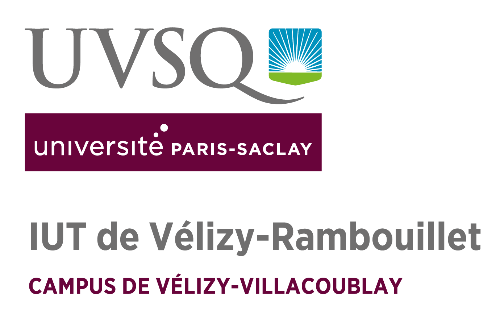

\centering



\Large Année : 2020/2021\hspace{50pt} IUT de Vélizy \hspace{50pt} Tuteur: M.Hoguin
\vfill
\large \hspace{10pt} PIERRE Tom - GIANNICO Raffaele - PARISOT Theo - MANOHARAN Anushan
\raggedright
\clearpage
\tableofcontents
```{r setup, include=FALSE}
knitr::opts_chunk$set(echo = TRUE)
```

`r if(knitr:::pandoc_to() == "latex") {paste("\\newpage")}`

## Remerciements
\centering
\vspace{75mm}
En premier lieu, nous tenons à remercier M. Hoguin, enseignant à l'Iut de Vélizy. En tant qu'enseignant, il nous a beaucoup appris et a partagé ses connaissances dans le domaine du réseau.

\vspace{5mm}

Nous souhaitons adresser nos remerciements aux enseignants du module Méthodologie de Production et d'Application de l'Iut de Vélizy, pour la qualité de l’enseignement.

\vspace{5mm}

Nous désirons aussi remercier tout les enseignants de l'Iut de Vélizy, car sans eux nous n'aurions pas pu faire ce travail.

\vspace{5mm}

Un grand merci à nos familles, pour leurs conseils ainsi que leurs soutiens moral.

\raggedright

`r if(knitr:::pandoc_to() == "latex") {paste("\\newpage")}`

## Résumé

### Résumé

### Sommaire

## Introduction

## Partie 1 : Solution proposée - Demarche utilisée

### Qualité Logicielle

#### La capacité fonctionnelle 

#### La fiabilité

#### la facilité d'utilisation

#### La performance

#### la maintenabilité

### Organisation de l'équipe

#### Organigrame

#### Raison

#### Avantages

### Méthode incrémentale

#### Explications

#### Raison 

#### Avantages

### Nos outils de suivi

#### La gestion de version - GIT

#### un agenda hybride

#### Communication générale

### Planification détaillée du projet

#### Ordonnancement

#### Diagramme de gantt

#### La gestion des compétences

#### La gestion des risques

## Partie 2 : analyse de la réalisation

### Exigences Critiques

### Exigences majeures

### Exigences Mineures

### Exigences supplémentaires

## Partie 3 : Conclusions et bilan du projet

### Bilan de réalisation

### Des evolutions possibles ?

### Des acquis divers et variés

#### Savoir-être

#### Savoir-Faire

### Une Experience fondamentale

## Partie 4 : Bibliographie

## Partie 5 : Annexes