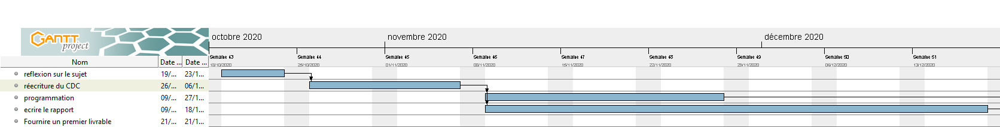
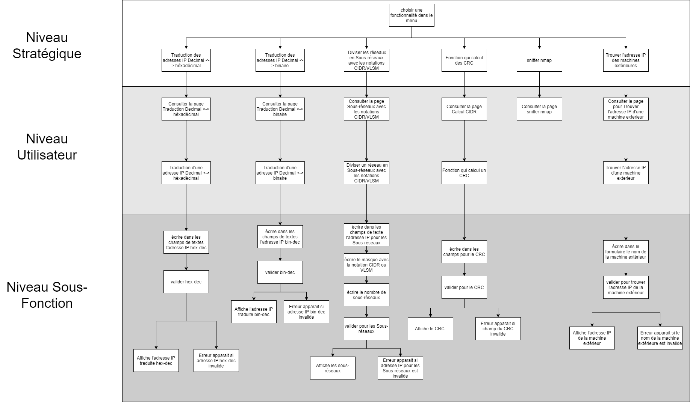

```{r setup, include=FALSE}
knitr::opts_chunk$set(echo = TRUE)
```
`r if(knitr:::pandoc_to() == "latex") {paste("\\newpage")}`


# Projet 
## Introduction 

La réalisation d'un projet tuteuré a de multiples objectifs: apprendre à travailler en groupe, se familiariser
avec des outils et des langages, apprendre à définir, analyser, réaliser et tester un système informatique
complexe. C'est pourquoi, le département Informatique de l'IUT nous a confié ce projet. 

Le projet final que nous devrons présenter sera une application pédagogique pour apprendre aux étudiants de première année de l'iut de Vélizy, ainsi qu'aux non initiés, les fondamentaux du réseau au travers d’une interface web. Cette interface web sera constituée de plusieurs pages internet contenant chacun une fonctionnalité de l'application (les fonctionnalitées sont décrite dans le cahier des charges qui sera transmis en Annexe 1). Ainsi nous apporterons une explication pour faire comprendre de manière simple le réseau aux étudiants. Il faudra alors réfléchir à notre interface web que nous allons mettre en place. C'est pourquoi nous devons non seulement se mettre à la place d’un développeur, mais aussi à la place de l'utilisateur, et devons trouver comment attirer les étudiants, comment leur donner envie d'apprendre le réseau.

Tout d'abord, nous sommes aller voir notre client (M.HOGUIN) pour lui poser des questions sur le projet et nous voulions savoir s'il y avait des éléments à rajouter.

Ensuite, nous avons pris connaissance de gitlab, une plateforme permettant d’héberger et de gérer des projets, il nous permettra une meilleure collaboration sur le projet. En effet, c'est un dépots commun, chaque membre du groupe peut accéder aux différents fichier du projet, même le client. C’est une plateforme gratuite, notre client peut donc voir les évolutions du projet apporté par le groupe. Il peut ainsi nous faire part des points qui ne correspondent pas à ses attentes. Nous pouvons alors travailler avec le client en direct, il est conseillé, après chaque modification apporté à un fichier, de les mettre à jour sur le gitlab. Ainsi que de partager le rapport pour un meilleur suivis de projet.

Une fois avoir pris connaissance de Gitlab, nous devons réécrire complètement le cahier des charges de notre point de vue, faire l’analyse des besoins et ensuite prendre rendez-vous avec le client afin de se mettre d’accord. Puis nous ajoutons à la fin du cahier des charges toutes les questions que nous nous posions (avec la réponse de notre client dans l’annexe 2):

Nous avons ensuite fait des recherches sur chaque fonctionnalitées (la récupération de l’adresse IP d’un client ou d’une personne qui se connecte sur une page web, comment afficher son adresse IP, comment à partir du PHP ou d’un autre langage web nous pouvons lancer un «nslookup», un « ping»).

Et nous devons présenter des maquettes de notre interface web pour avoir une idée de la forme finale du projet. Nous présenterons cette maquette au client afin d'obtenir son avis et ainsi changer les points souhaiter, pour que le client soit le plus satisfait possible.

Avant de programmer nous devons apprendre des notions avec M.HOGUIN qui est professeur de Réseau, car à cause du covid19, nous  n'avons pas pu apprendre ces notions l'année dernière. En effet, nous devions apprendre le CIDR et le VLSM qui nous permettrait de partager un réseau en sous réseau. Ensuite nous devons apprendre le calcul d’un crc de type Ethernet, connaître un sniffer nmap, et enfin savoir trouver une adresse IP d’une machine extérieur.

## L'organisation du travail 
Nous avons utilisé GitLab pour mieux collaborer entre nous mais aussi avec le client pour que nous puissions voir les évolutions.

Notre manière de communiquer était sur un groupe privé du logiciel Discord. Et de manière réccurente, nous nous échangions nos évolutions, ou alors nos idées.

Aussi nous avons utilisé la plateforme Zoom pour communiquer avec notre client, faire une réunion avec lui pour faire un point sur la situation, lui poser des questions, savoir ce qu’il pense de notre avancé du projet.

De plus, nous avons fait un diagramme de Gantt pour pouvoir situé les différentes tâches du projet dans le temps,Comme on peut voir sur le diagramme mis en annexe (?) Nos travaux ont été répartie sur plusieurs semaines, nous avons d'abord réfléchis sur le projet avec tout le monde pendant une semaines, ensuite on a réécrit le cahier des charges qui nous a pris environ deux semaines, ensuite nous avons fait en parallèle le développement et le rapport jusqu’au 18 décembre date ou le rapport doit être rendu.  

Apres discussion, nous avons aboutis à un accord. En effet, deux personnes s'occuperaient du developpement, et les deux autres du rapport.
Les deux personnes qui se chargent de programmer sont donc : Tom PIERRE et Raffaele GIANNICO.
Les deux personnes qui se chargent de d'ecrire le rapport sont donc : Anushan MANOHARAN et Théo PARISOT.
Mais c'est tâche peuvent aussi varier en fonction de la disponibilité de chacun.

## La programmation

Nous avons coder toutes nos pages en php qui contient du html et du css. Puis nous avons commencé à coder une page index qui serait la page d'accueil du site qui contient un menu pour choisir la fonctionnalité souhaiter, où vous pouvez retrouvez un aperçu en annexe ?.
De plus, nous avons commencer à coder les fonctionnalités une par une, dans l'ordre citée dans le cahier des charges.

Tom a codé la partie où l'utilisateur peut traduire une adresse IP décimal en hexadécimal ou inversement.
Théo s'est occupé la partie où l'utilisateur peut traduire une adresse IP décimal en binaire ou inversement.
Raffaele s'est occupé de la fonctionnalité qui permet de diviser le réseau en sous-réseaux avec la notation CIDR.
Anushan écrivait le rapport au fur et à mesure.


## Questions/réponses
Lors de nos réunions avec notre client nous avons pu échanger des questions, (date des réunion). Voici les questions posées au client ainsi que ces réponses :

Questions :

1. Est ce que l’application web doit être compatible avec Android? 
2. la dernière fonctionnalité: «trouver l’adresse ip d’une machine extérieure» ça sera celle de la personne qui se connecte à l'interface web?
3. Est-ce que l’application web devra être hébergée sur internet?
4. Préférez-vous une seule page avec toute la fonctionnalité ou une page index avec une page par fonctionnalité?
5. Comment proposer un sniffer de nmap?
6. Comment calculer un crc ?

Réponses : 
1. Non ce n’étais pas dans mon esprit,  je considère qu’on est que sur une application web classique.	
2. Non , je veux par exemple, un formulaire je tape www.uvsq.fr et quand je vais faire «valider» il va me retourner l’adresse ip du site web.
3. L'application sera hébergée en intranet
4. Il faut trouver le moyen d'accéder au système pour exécuter la commande nmap, peut-être regarder `exec` en PHP
5. Il faut trouver le moyen d'accéder au système pour exécuter la commande nmap, peut-être regarder `exec` en PHP.
6. Je vous donnerai les éléments en temps voulu.

`r if(knitr:::pandoc_to() == "latex") {paste("\\newpage")}`


## Les cas d'utilisations

Les acteurs de ce projet sont les étudiants de première année du département Informatique de l'iut de Vélizy.
Les objets sont :  menu, Adresses IP, masque, traduction, binaire, héxadécimal, décimal, valider, CIDR, VLSM, Calcul CRC, sniffer nmap, trouver, champs de textes.

Les actions sont donc :


- choisir une fonctionnalité dans le menu      					 
- Traduction des adresses IP Decimal <-> héxadécimal          	 
- Traduction des adresses IP Decimal <-> binaire              	 
- Diviser les réseaux en Sous-réseaux avec les notations CIDR/VLSM 
- Fonction qui calcul des CRC                                  	 
- sniffer nmap                                 					 
- Trouver l'adresse IP des machines extérieures 					 
- Consulter la page Traduction Decimal <-> héxadécimal			    
- Consulter la page Traduction Decimal <-> binaire				    
- Consulter la page Sous-réseaux avec les notations CIDR/VLSM		    
- Consulter la page Calcul CIDR										
- Consulter la page sniffer nmap										
- Consulter la page pour Trouver l'adresse IP d'une machine exterieur 
- Traduction d'une adresse IP Decimal <-> héxadécimal					
- Traduction d'une adresse IP Decimal <-> binaire						
- Diviser un réseau en Sous-réseaux avec les notations CIDR/VLSM		
- Fonction qui calcul un CRC											
- Trouver l'adresse IP d'une machine exterieur						
- écrire dans les champs de textes l'adresse IP hex-dec              
- écrire dans les champs de textes l'adresse IP bin-dec              
- écrire dans les champs de texte l'adresse IP pour les Sous-réseaux 
- écrire le masque avec la notation CIDR ou VLSM                     
- écrire le nombre de sous-réseaux                                   
- écrire dans les champs pour le CRC								   
- écrire dans les champs de textes l'adresse de la machine           
- valider hex-dec                                                    
- valider bin-dec                                                    
- valider pour les Sous-réseaux                                      
- valider pour le CRC												   
- valider pour trouver l'adresse IP de la machine extérieur		   
- Affiche l'adresse IP traduite hex-dec							   
- Affiche l'adresse IP traduite bin-dec							  
- Affiche les sous-réseaux										   
- Affiche le CRC 													   
- Affiche l'adresse IP de la machine extérieur					   
- Erreur apparait si adresse IP hex-dec invalide                     
- Erreur apparait si adresse IP bin-dec invalide                     
- Erreur apparait si adresse IP pour les Sous-réseaux est invalide   
- Erreur apparait si champ du CRC invalide						   
- Erreur apparait si le nom de la machine extérieure est invalide	   


Les étudiants pourront utiliser ces fonctionnalités. Vous pourrez trouver le schéma des cas d'utilisations en annexes 4.

`r if(knitr:::pandoc_to() == "latex") {paste("\\newpage")}`

# Annexes

## Annexe 1 : cahier des charges
| Développement d'une Application Web,  qui va aider les premieres années a l'iut de velizy | Version : 1        |   |   |   |
|-------------------------------------------------------------------------------------------|--------------------|---|---|---|
| Document : Cahier des charges                                                             | Date: <20/11/2020> |   |   |   |
| Responsable de la Redaction: Anushan                                                      |                    |   |   |   |
|                                                                                           |                    |   |   |   |

### Introduction
Ce projet tutoré qui nous a été confié par M.Hoguin professeur à l'iut de Vélizy est de créer une application web pédagogique afin d'aider les premières Années dans le module Réseau du département informatique.

### Enoncé
L’application web devra permettre aux étudiants débutants d’aborder les notions de réseau vue au semestre 1 sous un angle pédagogique et ludique au travers de possibles animations. L'application WEB devra contenir divers fonctionnalitées comme,
une fonction qui traduit les Adresses IP décimal en hexadécimal ou binaire et inversement.
Une fonction permettant de diviser un réseau en sous-réseaux avec la notation VLSM et CIDR.
De plus, l'application devrait proposer une fonctionnalité permettant de calculer un CRC de type ethernet.
Aussi, nous devons proposer un sniffer nmap. Et enfin, il sera possible de trouver l’adresse IP d’une machine extérieure.
D’autres idées pourront venir au cours du projet et de l’ambition du groupe d’étudiants qui auront à travailler sur ce projet.

### Prérequis
Avoir envie de travailler sur une application web et sur les connexions avec les outils réseaux

### Priorités
Les fonctionnalitées passent avant l'esthétique.

`r if(knitr:::pandoc_to() == "latex") {paste("\\newpage")}`

## Annexe 2 : cahier des charges Modifié
| Développement d'une Application Web,  qui va aider les premieres années a l'iut de velizy | Version : 2        |   |   |   |
|-------------------------------------------------------------------------------------------|--------------------|---|---|---|
| Document : Cahier des charges                                                             | Date: <30/11/2020> |   |   |   |
| Responsable de la Redaction: Raffaele                                                      |                    |   |   |   |
|                                                                                           |                    |   |   |   |

### Introduction
Ce projet tutoré qui nous a été confié par M.Hoguin professeur à l'iut de Vélizy est de créer une application web pédagogique afin d'aider les premières Années dans le module Réseau du département informatique.

### Enoncé
L’application web devra permettre aux étudiants débutants d’aborder les notions de réseau vue au semestre 1 sous un angle pédagogique et ludique au travers de possibles animations. L'application WEB classique sera hébergé en intranet et devra contenir divers fonctionnalités accessible depuis un menu. Le menu devra contenir le logo de l'UVSQ. L'utilisateur entre l'adresse IP dans des champs de texte, et le programme traduit ces Adresses IP décimal en hexadécimal ou binaire et inversement. Nous avons choisie de mettre un champ de texte pour chaque "partie" de l'adresse IP (par exemple: un champ 192, un champ 168, un champ 0, un champ 8, qui donne l'adresse IP 192.168.0.8). Si l'utilisateur entre un nombre supérieur a 255 en décimal une erreur apparaitra. De même pour la partie traduction en binaire, si pour un champ, l'utilisateur entre plus de 8 bits ou un chiffre non binaire, une erreur apparaitra. Et enfin, pour la partie traduction en hexadécimal si l'utilisateur entre un caractère non hexadécimal ou plus de 2 caractères par champs une erreur apparaitra.  

L'utilisateur entre l'adresse IP dans des champs de textes, entre le masque avec la notation CIDR, et le nombre de sous-réseaux souhaiter, le programme se chargera de diviser ce réseau en sous-réseaux avec la notation CIDR et VLSM. De même, si l'adresse IP n'est pas correctement entrer une erreur apparaitra. 

De plus, l'application devrait proposer une fonctionnalité permettant de calculer un CRC de type Ethernet. 

Aussi, nous devons proposer un sniffer nmap. Et enfin, il sera possible de trouver l’adresse IP d’une machine extérieure, l'utilisateur entre par exemple www.uvsq.fr lors de la validation et le programme retourner l’adresse IP du site web. 

D’autres idées pourront venir au cours du projet et de l’ambition du groupe d’étudiants qui auront à travailler sur ce projet. 


### Prérequis
Avoir envie de travailler sur une application web et sur les connexions avec les outils réseaux

### Priorités
Les fonctionnalitées passent avant l'esthétique.

`r if(knitr:::pandoc_to() == "latex") {paste("\\newpage")}`

## Annexe 3 : diagramme de gantt du projet
| Diagramme de Gantt du Projet tuteuré | Version : 1        |   |   |   |
|-------------------------------------------------------------------------------------------|--------------------|---|---|---|
| Document : Diagramme de Gantt                                                             | Date: <29/11/2020> |   |   |   |
| Responsable de la Redaction: Tom                                                      |                    |   |   |   |
|                                                                                           |                    |   |   |   |


Diagramme de Gantt : 


Comme on peut voir sur le diagramme mis en annexe (?) Nos travaux ont été répartie sur plusieurs semaines, nous avons d'abord réfléchis sur le projet avec tout le monde pendant une semaines, ensuite on a réécrit le cahier des charges qui nous a pris environ deux semaines, ensuite nous avons fait en parallèle le développement et le rapport jusqu’au 18 décembre date ou le rapport doit être rendu  


`r if(knitr:::pandoc_to() == "latex") {paste("\\newpage")}`

## Annexe 4 : Les cas d'utilisations
| Les cas d’utilisations du projet tuteuré | Version : 1        |   |   |   |
|-------------------------------------------------------------------------------------------|--------------------|---|---|---|
| Document : cas d’utilisations                                                            | Date: <20/11/2020> |   |   |   |
| Responsable de la Redaction: Raffaele                                                      |                    |   |   |   |
|                                                                                           |                    |   |   |   |

### Les différents Niveaux

| Niveau Stratégique                             					 |
|--------------------------------------------------------------------|
| - choisir une fonctionnalité dans le menu      					 |
| - Traduction des adresses IP Decimal <-> héxadécimal          	 |
| - Traduction des adresses IP Decimal <-> binaire              	 |
| - Diviser les réseaux en Sous-réseaux avec les notations CIDR/VLSM |
| - Fonction qui calcul des CRC                                  	 |
| - sniffer nmap                                 					 |
| - Trouver l'adresse IP des machines extérieures 					 |

| Niveau Utilisateur                                                    |
|-----------------------------------------------------------------------|
| - Consulter la page Traduction Decimal <-> héxadécimal			    | 
| - Consulter la page Traduction Decimal <-> binaire				    |
| - Consulter la page Sous-réseaux avec les notations CIDR/VLSM		    |
| - Consulter la page Calcul CIDR										|
| - Consulter la page sniffer nmap										|
| - Consulter la page pour Trouver l'adresse IP d'une machine exterieur |
| - Traduction d'une adresse IP Decimal <-> héxadécimal					|
| - Traduction d'une adresse IP Decimal <-> binaire						|
| - Diviser un réseau en Sous-réseaux avec les notations CIDR/VLSM		|
| - Fonction qui calcul un CRC											|
| - Trouver l'adresse IP d'une machine exterieur						|


| Niveau Sous Fonction                                                 |
|----------------------------------------------------------------------|
| - écrire dans les champs de textes l'adresse IP hex-dec              |
| - écrire dans les champs de textes l'adresse IP bin-dec              |
| - écrire dans les champs de texte l'adresse IP pour les Sous-réseaux |
| - écrire le masque avec la notation CIDR ou VLSM                     |
| - écrire le nombre de sous-réseaux                                   |
| - écrire dans les champs pour le CRC								   |
| - écrire dans les champs de textes l'adresse de la machine           |
| - valider hex-dec                                                    |
| - valider bin-dec                                                    |
| - valider pour les Sous-réseaux                                      |
| - valider pour le CRC												   |
| - valider pour trouver l'adresse IP de la machine extérieur		   |
| - Affiche l'adresse IP traduite hex-dec							   |
| - Affiche l'adresse IP traduite bin-dec							   |
| - Affiche les sous-réseaux										   |
| - Affiche le CRC 													   |
| - Affiche l'adresse IP de la machine extérieur					   |
| - Erreur apparait si adresse IP hex-dec invalide                     |
| - Erreur apparait si adresse IP bin-dec invalide                     |
| - Erreur apparait si adresse IP pour les Sous-réseaux est invalide   |
| - Erreur apparait si champ du CRC invalide						   |
| - Erreur apparait si le nom de la machine extérieure est invalide	   |





### Les différents Cas d'utilisations

Cas d'utilisation 1 : choisir une fonctionnalité dans le menu 

- Niveau : Stratégique
 
Cas d'utilisation 2 : Traduction Decimal <-> héxadécimal

- Niveau : Stratégique

Cas d'utilisation 3 : Traduction Decimal <-> binaire

- Niveau : Stratégique

Cas d'utilisation 4  : Diviser les réseaux en Sous-réseaux avec les notations CIDR/VLSM

- Niveau : Stratégique     					 

Cas d'utilisation 5 : Fonction qui calcul des CRC 

- Niveau : Stratégique
 
Cas d'utilisation 6 : sniffer nmap

- Niveau : Stratégique

Cas d'utilisation 7 : Trouver l'adresse IP des machines extérieures

- Niveau : Stratégique


Cas d'utilisation 8  : Consulter la page Traduction Decimal <-> héxadécimal

- Niveau : Utilisateur

Cas d'utilisation 9 : Consulter la page Traduction Decimal <-> binaire

- Niveau : Utilisateur
 
Cas d'utilisation 10 : Consulter la page Sous-réseaux avec les notations CIDR/VLSM

- Niveau : Utilisateur

Cas d'utilisation 11 : Consulter la page Calcul CIDR

- Niveau : Utilisateur

Cas d'utilisation 12  : Consulter la page sniffer nmap

- Niveau : Utilisateur     					 

Cas d'utilisation 13 : Consulter la page pour Trouver l'adresse IP d'une machine exterieur

- Niveau : Utilisateur
 
Cas d'utilisation 14 : Traduction d'une adresse IP Decimal <-> héxadécimal

- Niveau : Utilisateur

Cas d'utilisation 15 : Traduction d'une adresse IP Decimal <-> binaire

- Niveau : Utilisateur

`r if(knitr:::pandoc_to() == "latex") {paste("\\newpage")}`

Cas d'utilisation 16  : Diviser un réseau en Sous-réseaux avec les notations CIDR/VLSM

- Niveau : Utilisateur

Cas d'utilisation 17 : Calcul d'un CRC

- Niveau : Utilisateur
 
Cas d'utilisation 18 : Trouver l'adresse IP d'une machine exterieur

- Niveau : Utilisateur


Cas d'utilisation 19 : écrire dans les champs de textes l'adresse IP hex-dec

- Niveau : Sous-fonction

Cas d'utilisation 20  : valider hex-dec

- Niveau : Sous-fonction

Cas d'utilisation 21 : Affiche l'adresse IP traduite hex-dec

- Niveau : Sous-fonction
 
Cas d'utilisation 22 : Erreur apparait si adresse IP hex-dec invalide

- Niveau : Sous-fonction

Cas d'utilisation 23 : écrire dans les champs de textes l'adresse IP bin-dec

- Niveau : Sous-fonction

Cas d'utilisation 24  : valider bin-dec

- Niveau : Sous-fonction     					 

Cas d'utilisation 25 : Affiche l'adresse IP traduite bin-dec

- Niveau : Sous-fonction
 
Cas d'utilisation 26 : Erreur apparait si adresse IP bin-dec invalide

- Niveau : Sous-fonction

Cas d'utilisation 27 : écrire dans les champs de texte l'adresse IP pour les Sous-réseaux

- Niveau : Sous-fonction

Cas d'utilisation 28  : écrire le masque avec la notation CIDR ou VLSM

- Niveau : Sous-fonction

Cas d'utilisation 29  : écrire le nombre de sous-réseaux

- Niveau : Sous-fonction

Cas d'utilisation 30 : valider pour les Sous-réseaux

- Niveau : Sous-fonction
 
Cas d'utilisation 31 : Affiche les sous-réseaux

- Niveau : Sous-fonction

Cas d'utilisation 32 : Erreur apparait si adresse IP pour les Sous-réseaux est invalide

- Niveau : Sous-fonction
 
Cas d'utilisation 33 : écrire dans les champs pour le CRC

- Niveau : Sous-fonction

Cas d'utilisation 34 : valider pour le CRC

- Niveau : Sous-fonction

Cas d'utilisation 35  : Affiche le CRC 

- Niveau : Sous-fonction     					 

Cas d'utilisation 36 : Erreur apparait si champ du CRC invalide

- Niveau : Sous-fonction
 
Cas d'utilisation 37 : écrire dans le formulaire le nom de la machine extérieur

- Niveau : Sous-fonction

Cas d'utilisation 38 : valider pour trouver l'adresse IP de la machine extérieur

- Niveau : Sous-fonction

Cas d'utilisation 39  : Affiche l'adresse IP de la machine extérieur

- Niveau : Sous-fonction

Cas d'utilisation 40 : Erreur apparait si le nom de la machine extérieure est invalide

- Niveau : Sous-fonction

`r if(knitr:::pandoc_to() == "latex") {paste("\\newpage")}`

### Les différents cas d'utilisation selon le style étoffé

|                                 |                                                                                  |
|---------------------------------|----------------------------------------------------------------------------------|
| **Cas d'utilisation 1:**        | Choisir une fonctionnalité dans le menu                                          |
| **Nom:**                        | Choisir une fonctionnalité dans le menu                                          |
| **Contexte d'utilisation :**    | L’utilisateur aura le choix de consulter les différente fonctionnalité           |
| **Portée:**                     | site web                                                                         |
| **Acteur principal :**          | Utilisateur                                                                      |
| **Intervenants et Intérêts:**   |                                                                                  |
| **Précondition:**               |                                                                                  |
| **Scénario nominal:**           | La page s’affiche et la fonction affiche un résultat donc répond a l’utilisateur |
| **Extensions:**                 |                                                                                  |
| **Garantie minimale :**         | Accéder a la page souhaité par l’utilisateur                                     |
| **Garantie en cas de succès :** | La page s’affiche et la fonction affiche un résultat donc répond a l’utilisateur |
| **Déclencheur :**               | L’utilisateur doit sélectionner de lui même la fonction qu’il veut voir          |
| **informations connexes :**     | L’utilisateur ne peux pas modifier le site web comme il souhaite                 |


|                                 |                                                                                                                                                                             |
|---------------------------------|-----------------------------------------------------------------------------------------------------------------------------------------------------------------------------|
| **Cas d'utilisation 2:**        | Traduction Décimal < - > Hexadécimal                                                                                                                                        |
| **Nom:**                        | Traduction Décimal < - > Hexadécimal                                                                                                                                        |
| **Contexte d'utilisation :**    | L’utilisateur souhaite traduire des décimal en hexadécimal ou inverse                                                                                                       |
| **Portée:**                     |                                                                                                                                                                             |
| **Acteur principal :**          | Utilisateur                                                                                                                                                                 |
| **Intervenants et Intérêts:**   |                                                                                                                                                                             |
| **Précondition:**               | Avoir des décimal ou Hexadécimal a traduire                                                                                                                                 |
| **Scénario nominal:**           | 1.L’utilisateur choisis si il veut traduire de décimal a hexadécimal  		     2.L’utilisateur entre ses valeurs 		     3. Le résultat s’affiche ou un message d’erreur s’affiche |
| **Extensions:**                 |                                                                                                                                                                             |
| **Garantie minimale :**         | Traduis des deux sens                                                                                                                                                       |
| **Garantie en cas de succès :** | Traduis des deux sens et affiche un message d’erreur si besoin                                                                                                              |
| **Déclencheur :**               | L’utilisateur doit entrer ses valeurs et ensuite appuyer  sur Valider                                                                                                       |
| **informations connexes :**     |                                                                                                                                                                             |
`r if(knitr:::pandoc_to() == "latex") {paste("\\newpage")}`
|                                 |                                                                                                                                                                         |
|---------------------------------|-------------------------------------------------------------------------------------------------------------------------------------------------------------------------|
| **Cas d'utilisation 3:**        | Traduction Décimal < - > Binaire                                                                                                                                        |
| **Nom:**                        | Traduction Décimal < - > Binaire                                                                                                                                        |
| **Contexte d'utilisation :**    | L’utilisateur souhaite traduire des décimal en hexadécimal ou inverse                                                                                                   |
| **Portée:**                     |                                                                                                                                                                         |
| **Acteur principal :**          | Utilisateur                                                                                                                                                             |
| **Intervenants et Intérêts:**   |                                                                                                                                                                         |
| **Précondition:**               | Avoir des décimal ou Binaire a traduire                                                                                                                                 |
| **Scénario nominal:**           | 1.L’utilisateur choisis si il veut traduire de décimal en Binaire 		     2.L’utilisateur entre ses valeurs 		     3. Le résultat s’affiche ou un message d’erreur s’affiche |
| **Extensions:**                 |                                                                                                                                                                         |
| **Garantie minimale :**         | Traduis des deux sens                                                                                                                                                   |
| **Garantie en cas de succès :** | Traduis des deux sens et affiche un message d’erreur si besoin                                                                                                          |
| **Déclencheur :**               | L’utilisateur doit entrer ses valeurs et ensuite appuyer  sur Valider                                                                                                   |
| **informations connexes :**     |                                                                                                                                                                         |

|                                 |                                                                                                                                                                                                                          |
|---------------------------------|--------------------------------------------------------------------------------------------------------------------------------------------------------------------------------------------------------------------------|
| **Cas d'utilisation 4:**        | Diviser les réseaux en Sous-réseaux avec les notations CIDR/VLSM                                                                                                                                                         |
| **Nom:**                        | Diviser les réseaux en Sous-réseaux avec les notations CIDR/VLSM                                                                                                                                                         |
| **Contexte d'utilisation :**    | L’utilisateur entre une adresse IP et il aura en résultat les sous réseaux , il choisis le nombre de sous  réseaux qu’il souhaite et il choisis aussi sous quelle notation il veut                                       |
| **Portée:**                     |                                                                                                                                                                                                                          |
| **Acteur principal :**          | Utilisateur                                                                                                                                                                                                              |
| **Intervenants et Intérêts:**   |                                                                                                                                                                                                                          |
| **Précondition:**               | Entrer une adresse IP                                                                                                                                                                                                    |
| **Scénario nominal:**           | 1.L’utilisateur entre une adresse IP 		     2.L’utilisateur Choisis le nombre de sous réseaux  		     3. L’utilisateur choisis la notation entre CIDR et VLSM 		     4. Le résultat s’affiche ou un message d’erreur s’affiche |
| **Extensions:**                 |                                                                                                                                                                                                                          |
| **Garantie minimale :**         | affiche un message d’erreur                                                                                                                                                                                              |
| **Garantie en cas de succès :** | Affiche le résultat                                                                                                                                                                                                      |
| **Déclencheur :**               | L’utilisateur doit entrer ses valeurs choisir le nombre de sous réseaux et choisir la notation et ensuite appuyer  sur Valider                                                                                           |
| **informations connexes :**     |                                                                                                                                                                                                                          |


## Annexe 5 : Le recueil des besoins
| Le recueil des besoins du projet tuteuré | Version : 1        |   |   |   |
|-------------------------------------------------------------------------------------------|--------------------|---|---|---|
| Document : recueil des besoins                                                            | Date: <14/12/2020> |   |   |   |
| Responsable de la Redaction: Anushan                                                      |                    |   |   |   |
|                                                                                           |                    |   |   |   |


Chapitre 1 – Objectif et portée
1. Quels sont la portée et les objectifs généraux ?

La portée du projet est un site web, accompagné des demandes de notre client c’est a dire :

-Traduire Décimal en Hexadécimal
-Traduire Décimal en binaire
-Afficher des sous réseaux
- Le calcul du CIDR
-Faire un sniffer nmap
-Trouver l’adresse IP d’une machine extérieur
 
	Les objectifs généraux sont de faire un site web qui a pour but pédagogique donc d’aider des étudiant pour la matière du réseau , répondre au attente de notre client , le

2. Les intervenants. (Qui est concerné ?)

Les intervenants sont les étudiants de Première année en IUT informatique , le client qui est aussi professeur dans cet matière

3. Qu'est-ce qui entre dans cette portée ? Qu'est-ce qui est en dehors ? (Les limites du système.)
Les étudiants et le client pourront consulter le site web et interagir avec les fonctionnalité proposé par le site
 


 Chapitre 2 – Terminologie employée / Glossaire

 Chapitre 3 – Les cas d'utilisation
1. Les acteurs principaux et leurs objectifs généraux.
Les étudiants, le client sont les acteurs principaux
l’objectif des étudiants est de comprendre la matière du Réseaux donc aidé le client pour ses élèves

2. Les cas d'utilisation métier (concepts opérationnels).

3. Les cas d'utilisation système.


Chapitre 4 – La technologie employée
1. Quelles sont les exigences technologiques pour ce système ?
Connaître les langages pour un site web , comprendre le réseaux ainsi que les formules ,

2. Avec quels systèmes ce système s'interfacera-t-il et avec quelles exigences ?
Sur un site web

Chapitre 5 – Autres exigences

1. Processus de développement

i. Qui sont les participants au projet ?
Un groupe de 4 étudiants qui font partie de l’UVSQ en second d’année d’informatique

ii. Quelles valeurs devront être privilégiées ? (exemple : simplicité, disponibilité, rapidité, souplesse etc... )
Pédagogique , simple , intuitif , efficace , compréhensible

iii. Quels retours ou quelle visibilité sur le projet les utilisateurs et commanditaires 2/10 souhaitent-ils ?

iv. Que peut-on acheter ? Que doit-on construire ? Qui sont nos concurrents ?

v. Quels sont les autres exigences du processus ? (exemple : tests, installation, etc.)

vi. A quelle dépendance le projet est-il soumis ?

	2. Règles métier
	3. Performances
	4. Opérations, sécurité, documentation
	5. Utilisation et utilisabilité
	6. Maintenance et portabilité
	7. Questions non résolues ou reportées à plus tard

 Chapitre 6 – Recours humain, questions juridiques, politiques, organisationnelles.
 
	1. Quel est le recours humain au fonctionnement du système ?
	2. Quelles sont les exigences juridiques et politiques ?
	3. Quelles sont les conséquences humaines de la réalisation du système ?
	4. Quels sont les besoins en formation ? 5. Quelles sont les hypothèses et les dépendances affectant l'environnement humain ?


